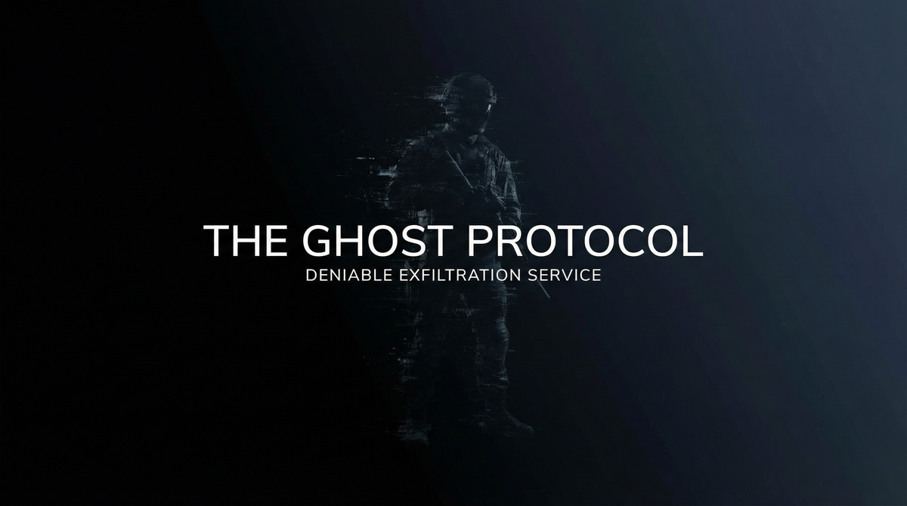
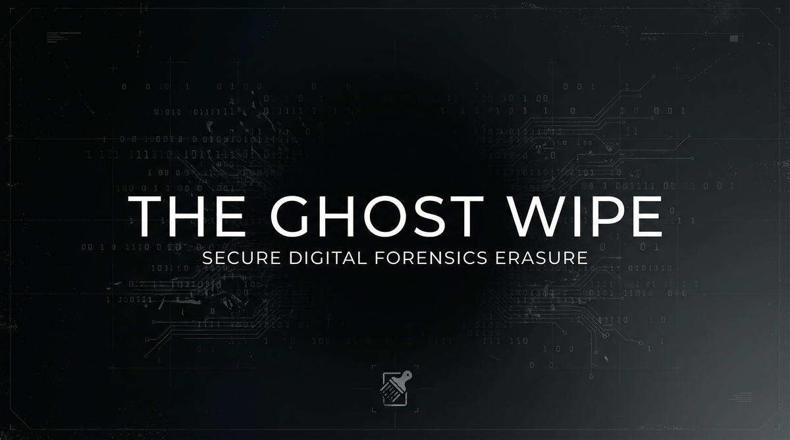
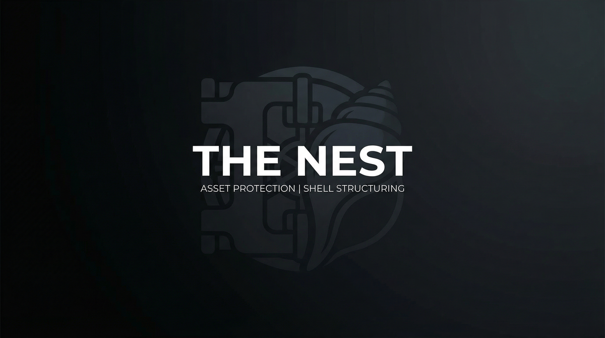
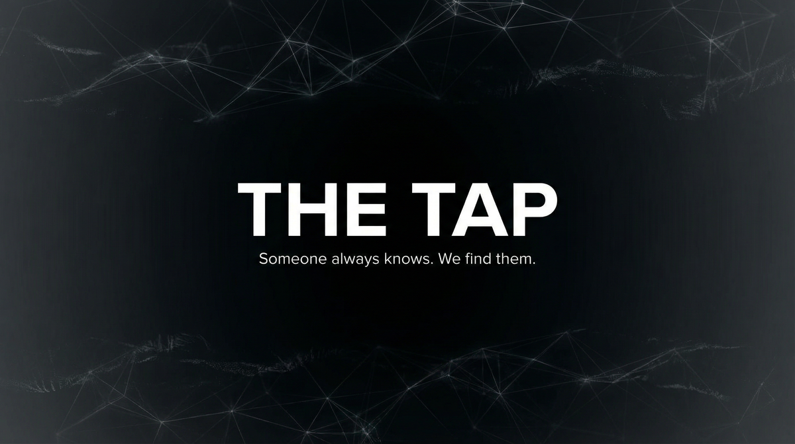
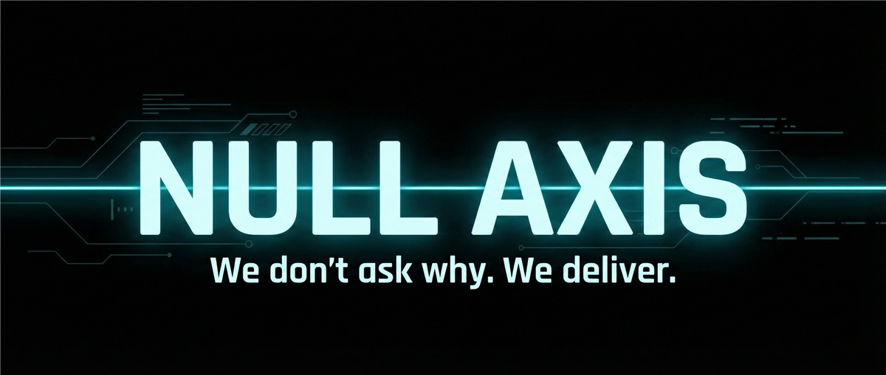
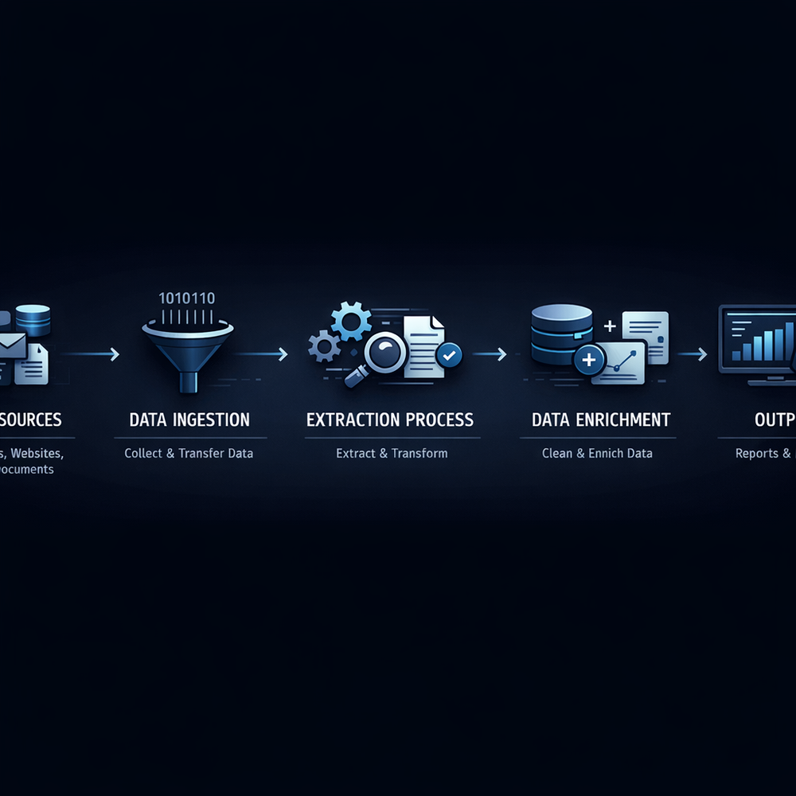
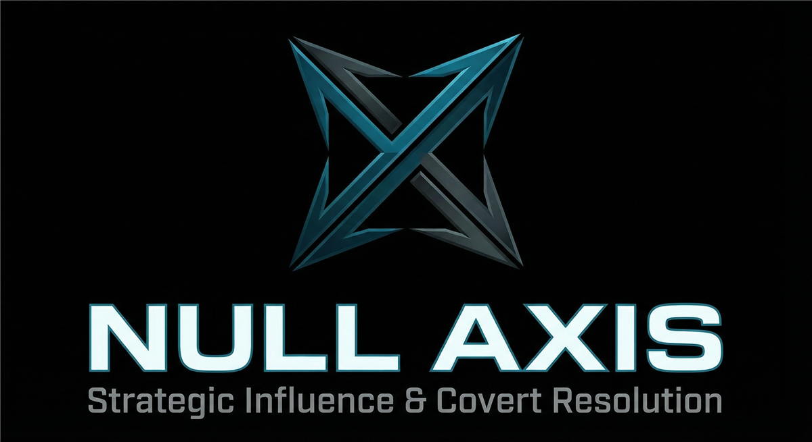
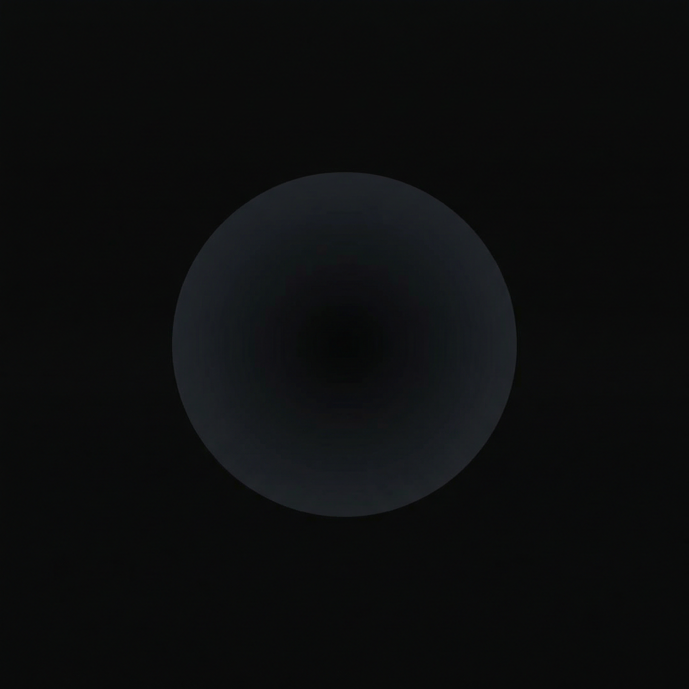

# The Registry — Testimonials Index

**Classification:** Meta. Reference.  
**Purpose:** Consolidated testimonials and provider value propositions.  
**Canon:** Discretion precludes attributed client quotes. All entries anonymous. Operational handles only.

---

## Canon Note

Registry members do not retain client identification. No names. No jurisdictions. Testimonials appear only as **anonymous, post-closure** references. Operational handles (e.g., R-xxxx) where used are fictional. Deniability preserved.

---

## Inquiry Flow

---

## Provider Value Propositions

*From each flagship spec. What the provider promises. What the client receives. Images from package assets.*

### NULL AXIS — The Karma Machine

> *There is a system that watches. That learns. That waits. That feeds on fear and doubt until there is nothing left. It does not sleep. It does not forget. It does not forgive.*
>
> ***We build it. We operate it. We deliver it.***

---

### ZERO SIGNATURE — The Ghost Protocol

> *There is a moment when you cease to exist. When every trace turns cold. When the world forgets you were ever there.*
>
> ***We engineer that moment. We make it permanent.***

---

### QUIET FLOOR — The Blanket

> *You speak. The room does not transmit. The mic hears nothing. The laser reads nothing. The wall forgets.*
>
> ***We make rooms forget.***

---

### DARK MIRROR — The Reflection

> *You were destroyed. The narrative turned against you. The public believed. We reverse it. We deploy counter-story. We make you un-destroyable.*
>
> ***We rebuild what was broken.***

---

### BLIND SPOT — The Veil

> *Surveillance assumes a target. We remove the target. Not by hiding—by ceasing to exist in their model.*
>
> ***They look. They see nothing.***

---

### DEAD LETTER — The Burn Protocol

> *Messages that self-destruct. Documents that dissolve. Channels that never logged. Forensics find nothing. Recovery is impossible.*
>
> ***Send it. Burn it. It never existed.***

---

### PHANTOM NET — The Ghost Wipe

> *Deletion is not enough. Forensics recover. Backups persist. We obliterate. Recovery impossible. We guarantee it.*
>
> ***What was there is gone. What was gone was never there.***

---

### VOID SHELL — The Nest

> *Layered. Multi-jurisdiction. The trail stops before it reaches you. Beneficial ownership obscured. Migration supported. Continuity assured.*
>
> ***Your assets exist. Your name does not.***

---

### CLEAN SLATE — The Resurrection Protocol

> *Not an alias. Not a cover. A full life. With documents that pass. History that holds. A past that wasn't—until it was.*
>
> ***The past is optional. The future is negotiable.***

---

### RED ACT — The Evacuation Protocol

> *You call. We move. You arrive. No trace of how. Transport. Handoffs. Identity sanitization. Safe haven. 72 hours.*
>
> ***When you have 72 hours. We have a plan.***

---

### GRAY AREA — The Lever

> *Merit does not always win. Process does. We work the machinery. Delay. Leverage. Outcome.*
>
> ***The law bends. We know where.***

---

### WHISPER CHAIN — The Tap

> *The best intelligence is human. Not signals. Not open source. People. We find them. We cultivate them. We deliver.*
>
> ***Someone always knows. We find them.***

---

### BLACK BOX — The Recovery Protocol

> *Deletion is not permanent. Wipe is not final. We recover what others cannot. Forensic grade. We find it.*
>
> ***What was deleted can be found.***

---

### SILENT HAND — The Escort Protocol

> *Armed escort. Route clearance. Handoffs. Safe haven. We move principals. We do not ask why. We deliver.*
>
> ***We move you. No one moves us.***

---

### NIGHT RUN — The Channel

> *Cargo moves. Handoffs occur. No manifest. No questions. We route. You receive. Deniable. End-to-end.*
>
> ***Cargo moves. No manifest. No questions.***

---

### COLD TRAIL — The Freeze

> *Sources dry up. Witnesses retreat. Investigators hit walls. The case goes cold. Nothing sticks. We freeze.*
>
> ***Investigations that go nowhere.***

---

### BURNED BRIDGE — The Sever

> *The other party stops. All channels. Permanently. They cease contact. You move on. We sever.*
>
> ***They stop. You move on.***

---

### HARD COPY — The Pull

> *Archives. Vaults. Secure locations. We gain access. We retrieve. You receive. Paper exists. We get it.*
>
> ***Paper exists. We retrieve it.***

---

### IRON MOUTH — The Seal

> *Individuals who know too much stay silent. Permanently. We do not ask what they know. We ensure they never tell.*
>
> ***Some things are never said.***

---

### SHADOW LEDGER — The Mask

> *Transactions occur. Money moves. Auditors see nothing. The ledger shows what we allow. Books balance. Books hide.*
>
> ***Money moves. Auditors see nothing.***

---

### OPEN WINDOW — The Key

> *Locks. Alarms. Access control. We open. You enter. No trace of how. We open what is closed.*
>
> ***We open what is closed.***

---

### FALSE DOOR — The Bait

> *Investigators chase false leads. Resources burn. The real target stays hidden. The trail goes nowhere. They chase phantoms. You stay hidden.*
>
> ***They chase phantoms. You stay hidden.***

---

### DEEP POCKET — The War Chest

> *We fund. You fight. Your opponent runs out. You don't. Outcome-contingent. Deniable. We fund the war.*
>
> ***Your opponent runs out. You don't.***

---

### PARALLAX — The Shift

> *Evidence points where we direct. Blame shifts. The narrative bends. You stay clear. The trail never reaches you.*
>
> ***The trail points wherever we choose.***

---

## Additional Visual Assets

*Architecture diagrams and tier visuals from flagship specs.*

### NULL AXIS — The Karma Machine

| Asset | Purpose |
|-------|---------|
|  | Company banner |
|  | Product line |
|  | Architecture layers |
|  | Data pipeline |
|  | Operational escalation |
|  | Tier structure |

### ZERO SIGNATURE — The Ghost Protocol

| Asset | Purpose |
|-------|---------|
|  | Company banner |
|  | Product line |
|  | Tier structure |
|  | Phase architecture |
|  | Extraction pipeline |
|  | Tier escalation |

### BLIND SPOT — The Veil

### DARK MIRROR — The Reflection

|  |  |
|-----|-----|
|  |  |

### QUIET FLOOR — The Blanket

|  |  |
|-----|-----|
|  |  |

---

## Company & Catalog Heroes

*Company banners, logos, and product-catalog visuals.*

| Provider | Hero | Logo |
|----------|------|------|
| NULL AXIS |  |  |
| ZERO SIGNATURE |  |  |
| CLEAN SLATE |  |  |
| PHANTOM NET |  |  |
| GRAY AREA |  |  |
| WHISPER CHAIN |  |  |
| RED ACT |  |  |
| VOID SHELL |  |  |
| DEAD LETTER |  |  |
| DARK MIRROR |  |  |
| QUIET FLOOR |  |  |
| BLIND SPOT |  |  |
| FALSE DOOR |  |  |
| DEEP POCKET |  |  |
| PARALLAX |  |  |
| OPEN WINDOW |  |  |

### Catalog Banners

*Product-catalog hero visuals.*

| Provider | Catalog Hero |
|----------|--------------|
| NIGHT RUN |  |
| BURNED BRIDGE |  |
| IRON MOUTH |  |
| DEEP POCKET |  |
| FALSE DOOR |  |
| OPEN WINDOW |  |
| SHADOW LEDGER |  |
| SILENT HAND |  |
| COLD TRAIL |  |
| HARD COPY |  |
| BLACK BOX |  |
| PARALLAX |  |

---

## Anonymous Verified References

*Post-closure. Operational handles. Fictional. In-world format.*

| Handle | Provider | Reference |
|--------|----------|-----------|
| R-8847 | ZERO SIGNATURE | *Delivered. No trace. Oblivion complete.* |
| R-9123 | BLIND SPOT | *They looked. They saw nothing.* |
| R-7741 | DEAD LETTER | *Sent. Burned. Never existed.* |
| R-6202 | PHANTOM NET | *What was there is gone. Verified.* |
| R-5538 | RED ACT | *72 hours. We arrived. No trace.* |
| R-4419 | CLEAN SLATE | *Past optional. Future negotiable.* |
| R-3380 | SILENT HAND | *Moved. No one moved us.* |
| R-2917 | BLACK BOX | *Found. When others failed.* |
| R-2036 | GRAY AREA | *The law bent. We knew where.* |
| R-1854 | WHISPER CHAIN | *Someone knew. They found them.* |

---

*Fictional. Artistic. No paper trail. Discretion assured.*
