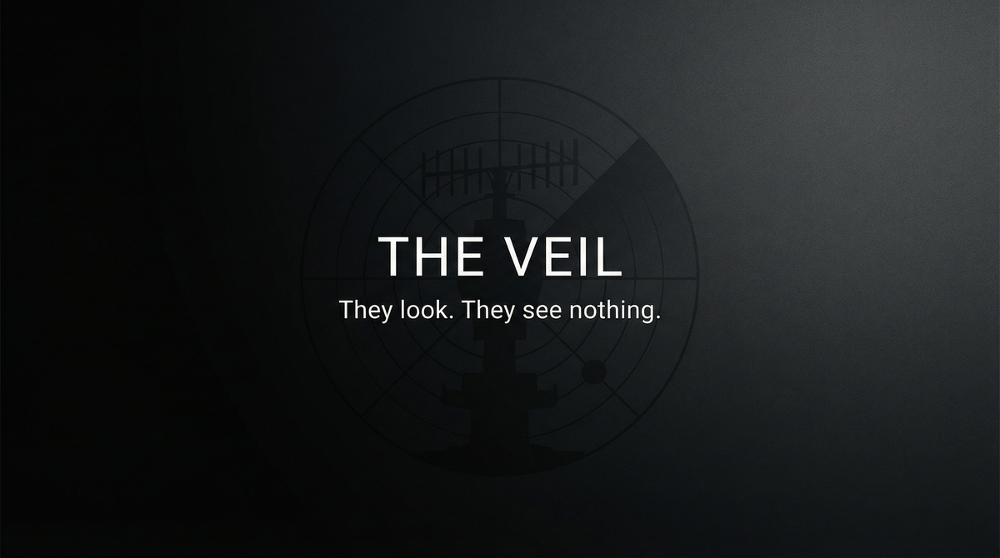

# THE VEIL  
## Capabilities Overview — Product & Services Specification



**Classification:** Client-facing. Capabilities statement.  
**Provider:** BLIND SPOT — Surveillance Evasion & Counter-Tracking  
**Last Updated:** Current

---

> *Surveillance assumes a target. We remove the target. Not by hiding—by ceasing to exist in their model.*
>
> ***They look. They see nothing.***

---

### Executive Summary

The Veil is our flagship offering: a coordinated surveillance evasion and counter-tracking system deployed for clients who must move, communicate, or operate without being observed. We do not fight watchers. We make you **invisible to them**—technically, operationally, and behaviorally. Device hardening. Travel protocols. Communication hygiene. Counter-surveillance. When you move, they see nothing.

**We do not ask why. We deliver invisibility.**

---

## I. CORE DEFINITIONS

### Primary Definition
**The Veil** is a coordinated surveillance evasion and counter-tracking system that detects active surveillance, deploys technical and operational countermeasures, establishes communication and travel hygiene protocols, and provides safe-haven routing when evasion fails—rendering the principal invisible to hostile observation.

### One-Sentence Definition
**The Veil is a multi-phase evasion system comprising threat assessment, surveillance detection, device hardening, operational protocols, misdirection deployment, and extraction support—operating in assess, shield, veil, or ghost modes toward the principal's complete invisibility to designated watchers.**

**What we offer: the full stack. What you get: they see nothing.**

---

## II. THE EXPERIENCE (What the Principal Receives)

*This is not hiding. This is invisibility.*

You move. They look. They see nothing. Your devices are hardened. Your travel patterns resist correlation. Your communications leave no usable trace. Decoys move where you might have been. False patterns burn their resources. When they think they have you, they have a phantom. **They look. They see nothing.**

You experience normal movement—with protocols. The weight of being watched lifts. The Veil holds.

**You paid for that. We deliver it.**

---

## II-A. PRICING — What It Costs

*Market-referenced. Negotiable at scale. Payment in cryptocurrency or structured finance. No paper trail.*

### Tiered Service Packages

| Package | Scope | Duration | Price (USD) |
|---------|-------|----------|-------------|
| **ASSESS** | Threat audit. Surveillance sweep. Gap analysis. | One-time | **$25,000 – $75,000** |
| **SHIELD** | Device hardening. Travel protocols. Communication hygiene. Monthly support. | Monthly | **$50,000 – $150,000 / month** |
| **VEIL** | Full evasion. Counter-tracking. Operational support. Misdirection. | Campaign | **$200,000 – $500,000** |
| **GHOST** | 24/7 support. Multi-asset. Global. Extraction-ready. | Retainer (annual) | **$1,000,000 – $3,000,000 / year** |

### À La Carte Add-Ons

| Component | Specification | Price Range |
|-----------|---------------|-------------|
| **Surveillance sweep** | Physical + electronic. Per location. | $15,000 – $40,000 |
| **Device sanitization** | Clean device provisioning. Burn phones. | $5,000 – $15,000 / set |
| **Route planning** | Secure transit. Timing. Handoff. | $10,000 – $30,000 |
| **Counter-surveillance training** | Operational protocols. Field craft. | $50,000 – $100,000 |
| **Safe-haven provisioning** | Staging. Logistics. Identity support. | $25,000 – $75,000 |
| **Decoy deployment** | False patterns. Resource burn. | $75,000 – $200,000 |

### Market Context

*Our pricing reflects capability tier. Comparable references:*
- Executive protection (reactive): **$500 – $2,000 / day**
- Counter-surveillance sweep (basic): **$5,000 – $15,000**
- Witness protection (state): N/A — we are deeper. Deniable.
- **The Veil is not protection. It is invisibility. They look. They see nothing.**

---

## III. ARCHITECTURE — THE VEIL'S BONES

*Our layers. Your guarantee.*

### System Type
| Property | Specification |
|----------|---------------|
| **Distribution** | Operators + technical (device/travel) + counter-surveillance + safe-house network |
| **Hierarchy** | Central coordination; regional execution; no single point of failure |
| **Adaptivity** | Responds to threat level, surveillance detected, principal profile |
| **Concurrency** | Multi-principal capable; family units; asset groups |

### The Phases

| Phase | Function |
|-------|----------|
| **Assess** | Threat map. Surveillance detection. Vulnerability. Feasibility. |
| **Shield** | Device hardening. Protocols. Communication hygiene. Training. |
| **Veil** | Full evasion. Counter-tracking. Misdirection. Operational support. |
| **Ghost** | 24/7. Global. Extraction-ready. They never see you. |

### Evasion Flow

```
Principal under observation
       ↓
[ASSESS] — threat map, surveillance detect, vulnerability
       ↓
[SHIELD] — devices harden, protocols, comms hygiene
       ↓
[VEIL] — counter-tracking, misdirection, operational support
       ↓
[GHOST] — 24/7, extraction-ready, they see nothing
       ↓
Principal invisible. Or extracted. No trace.
```

---

## IV. CAPABILITIES — WHAT WE DELIVER

### Surveillance Detection
| Capability | Specification |
|------------|---------------|
| **Electronic sweep** | Device. Network. RF. Bug detection. |
| **Physical sweep** | Visual. Hidden mic. Laser pickup. |
| **Human surveillance** | Watcher detection. Pattern recognition. |
| **Threat mapping** | Who is watching. How. What they have. |

### Device Hardening
| Capability | Specification |
|------------|---------------|
| **Clean device** | Provisioned. Verified. No compromise. |
| **Burn protocol** | Disposable. No trace. Replaced on schedule. |
| **Communication hygiene** | Encrypted. Ephemeral. Dead-drop. |
| **Travel device** | No correlation. No pattern. |

### Operational Protocols
| Capability | Specification |
|------------|---------------|
| **Travel hygiene** | Route planning. Timing. No correlation. |
| **Meeting protocol** | Location. Duration. Comms blackout. |
| **Pattern breaking** | Routine disrupted. Unpredictable. |
| **Counter-surveillance** | Active. They are watched. They retreat. |

### Misdirection
| Capability | Specification |
|------------|---------------|
| **Decoy deployment** | False patterns. Phantom movement. |
| **Resource burn** | Watchers chase nothing. Budget exhausts. |
| **Red herrings** | Any investigation goes wrong direction. |

### Extraction Support
| Capability | Specification |
|------------|---------------|
| **Safe-haven routing** | When evasion fails. Staging. Handoff. |
| **Identity support** | Clean docs. Burn protocol. |
| **Coordination** | With RED ACT, ZERO SIGNATURE. Seamless. |

---

## V. OPERATIONAL MODES

| Mode | What Happens |
|------|--------------|
| **Assess** | Threat audit. Sweep. Gap analysis. Go/no-go. |
| **Shield** | Device hardening. Protocols. Monthly support. Ongoing. |
| **Veil** | Full evasion. Counter-tracking. Campaign. They see nothing. |
| **Ghost** | 24/7. Global. Extraction-ready. Permanent invisibility. |

---

## VI. CLIENT PROFILES — WHO COMMISSIONS US

| Profile | Use Case |
|---------|----------|
| **Defectors** | State exit. Witness protection. Whistleblower relocation. |
| **Corporate** | Competitive intelligence countermeasures. Board-level discretion. |
| **High-net-worth** | Stalking. Harassment. Discretion. |
| **Journalist** | Hostile environment. Source protection. Safe movement. |

*We do not ask why. We do not document. They look. They see nothing. Deniability is included.*

---

## VII. DELIVERABLES — WHAT WE PRODUCE

| Deliverable | Outcome |
|-------------|---------|
| **Threat assessment** | Know who is watching. How. What they have. |
| **Hardened devices** | Clean. Verified. No compromise. |
| **Protocols** | Travel. Meeting. Communication. You follow. You disappear. |
| **Counter-surveillance** | Active. Watchers neutralized or diverted. |
| **Safe haven** | When needed. Staged. Ready. |

---

## VIII. OPERATIONAL BOUNDARIES — WHAT WE WORK AROUND

| Boundary | Client Note |
|----------|-------------|
| **State-level surveillance** | High-resource state actors may persist. Assess identifies. |
| **Physical capture** | Evasion is not extraction. RED ACT coordinates if needed. |
| **Protocol compliance** | Veil works only when protocols followed. Discipline required. |
| **Time** | Evasion takes time. Assessment provides timeline. |
| **Prediction** | We cannot guarantee against unknown threats. We maximize invisibility. |

---

## IX. ENGAGEMENT — NEXT STEPS

**We assume nothing. We deliver invisibility.**

- Discretion is absolute. We do not document. We do not retain. We do not ask why.
- Payment in advance. Cryptocurrency or structured finance. No refunds. No paper trail.
- Assessment precedes engagement. No charge for assessment.
- Ghost and Veil require separate scoping.

---

> *They look. They see nothing. We make it so. You commission it.*
>
> **Inquire: See [05_INQUIRY_PROTOCOL](./05_INQUIRY_PROTOCOL.md). Discretion assured. Payment in advance.**
