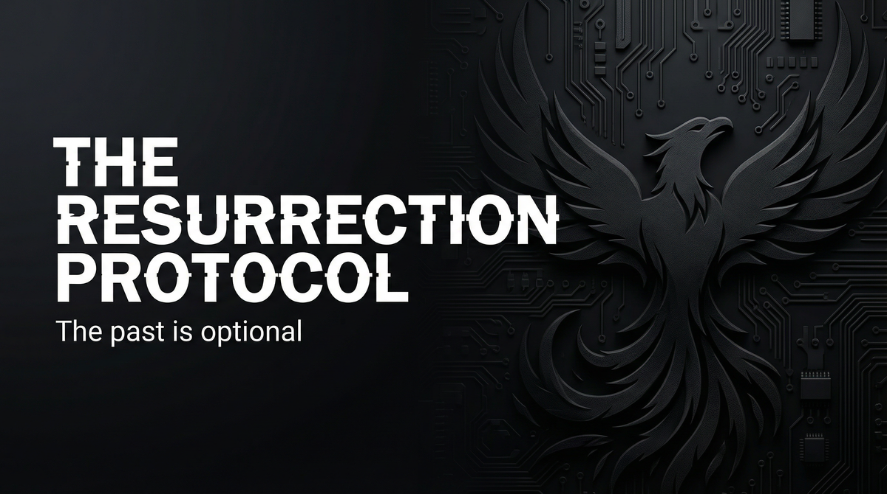

# THE RESURRECTION PROTOCOL  
## Capabilities Overview — Product & Services Specification

**Classification:** Client-facing. Capabilities statement.  
**Provider:** CLEAN SLATE — Identity Resurrection & Document Fabrication  
**Last Updated:** Current

---

> *Not an alias. Not a cover. A full life. With documents that pass. History that holds. A past that wasn't—until it was.*
>
> ***The past is optional. The future is negotiable.***

---

### Executive Summary

The Resurrection Protocol is our flagship offering: full identity fabrication with verifiable documentation and embedded history. Birth certificates. Passports. Credit history. Employment records. Backstory. Documents that pass inspection. History that holds. **A new life that passes.**

**We do not ask why. We deliver resurrection.**

---

## I. CORE DEFINITIONS

### Primary Definition
**The Resurrection Protocol** is a coordinated identity fabrication system that produces verifiable documents (birth, ID, passport, education, employment), sculpts credit history, embeds backstory with references and digital footprint—delivering a complete, durable identity that passes inspection.

### One-Sentence Definition
**The Resurrection Protocol is a multi-tier identity fabrication system comprising document production, credit sculpting, backstory embedding, and verification—operating in documents, full-identity, resurrection, or legacy modes toward the client's complete, verifiable new life.**

**What we offer: the full stack. What you get: the past is optional.**

---

## II. THE EXPERIENCE (What the Client Receives)

*This is not an alias. This is resurrection.*

You receive a full identity. Birth certificate. Passport. Credit history. Employment records. Backstory. Documents pass. History holds. The past that wasn't—is now. You are someone else. Verifiably. Durable.

**You paid for that. We deliver it.**

---

## II-A. PRICING — What It Costs

### Tiered Service Packages

| Package | Scope | Price (USD) |
|---------|-------|-------------|
| **DOCUMENTS** | Basic set. Birth. ID. Passport. | $75,000 – $200,000 |
| **FULL IDENTITY** | Complete. Credit. Employment. Backstory. | $250,000 – $500,000 |
| **RESURRECTION** | Full protocol. Embedded. Durable. | $750,000 – $2,000,000 |
| **LEGACY** | Multiple identities. Family. Generational. | Custom |

### À La Carte: Per-document $15K–$50K | Credit sculpting $50K–$150K | Employment embedding $25K–$75K

---

## III. ARCHITECTURE — Document pipeline, Credit sculpting, Backstory embedding

## IV. CAPABILITIES — Document fabrication, Credit sculpting, Verification

## V. OPERATIONAL MODES — Documents, Full Identity, Resurrection, Legacy

## VI. CLIENT PROFILES — Defection, Witness, Reputation death, Litigation escape

## VII. DELIVERABLES — Documents, Credit, Backstory, Verification

## VIII. OPERATIONAL BOUNDARIES — Jurisdiction, Verification limits, Client compliance

## IX. ENGAGEMENT — NEXT STEPS

**We assume nothing. We deliver resurrection.** Payment in advance. Assessment precedes engagement. No charge for assessment.

---

> *The past is optional. The future is negotiable.*
>
> **Inquire: See [05_INQUIRY_PROTOCOL](./05_INQUIRY_PROTOCOL.md). Discretion assured. Payment in advance.**
