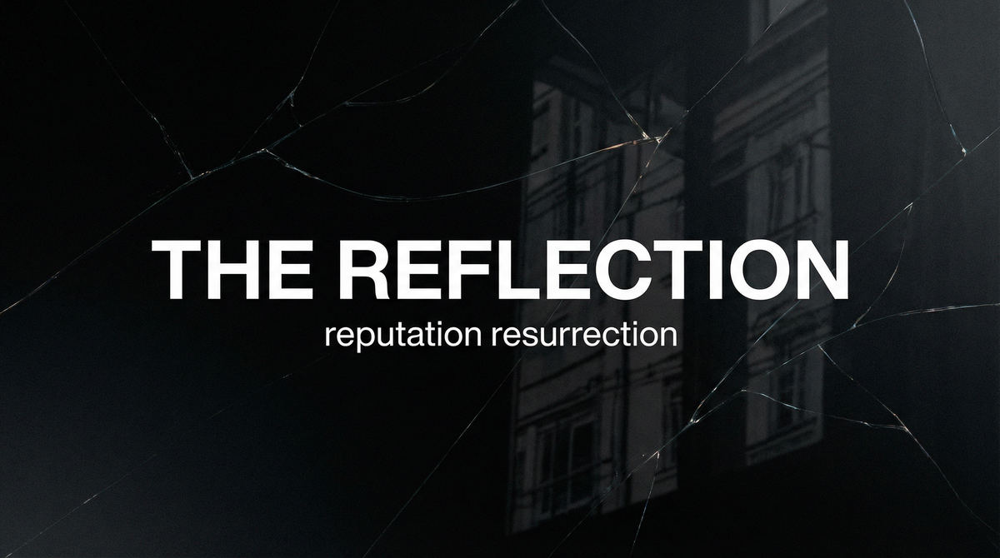

# THE REFLECTION  
## Capabilities Overview — Product & Services Specification



**Classification:** Client-facing. Capabilities statement.  
**Provider:** DARK MIRROR — Reputation Resurrection & Narrative Repair  
**Last Updated:** Current

---

> *You were destroyed. The narrative turned against you. The public believed. We reverse it. We deploy counter-story. We make you un-destroyable.*
>
> ***We rebuild what was broken.***

---

### Executive Summary

The Reflection is our flagship offering: a multi-vector reputation repair system deployed for clients whose public image has been damaged by smear campaigns, leaks, or manufactured narratives. We do not erase—we **reframe**. We deploy counter-narratives through content seeding, influence mapping, third-party validation, and search result manipulation. The new story gains traction. The old story recedes. You become un-destroyable.

**We do not ask why. We deliver repair.**

---

## I. CORE DEFINITIONS

### Primary Definition
**The Reflection** is a coordinated narrative repair system that deploys counter-stories, content seeding, influence mapping, and search manipulation to reverse reputational damage—replacing the dominant negative narrative with a repair narrative that gains third-party validation and public traction.

### One-Sentence Definition
**The Reflection is a multi-vector reputation resurrection system comprising damage assessment, counter-narrative design, content seeding, influence mapping, third-party validation, and search result manipulation—operating in assess, single-crisis, ongoing, or deep-reflection modes toward the client's reputational repair and narrative dominance.**

**What we offer: the full stack. What you get: un-destroyable.**

---

## II. THE EXPERIENCE (What the Client Receives)

*This is not PR. This is repair.*

Your reputation was destroyed. The narrative turned. The public believed. We deploy counter-story. We seed it through authentic sources. We map who influences the narrative—and we reach them. Third parties begin to say what we designed. The search results shift. The negative recedes. The positive dominates. **You become un-destroyable.**

You do not appear in the repair. We do not appear. The story spreads organically—or so it appears. Deniability preserved. The past works for you.

**You paid for that. We deliver it.**

---

## II-A. PRICING — What It Costs

*Market-referenced. Negotiable at scale. Payment in cryptocurrency or structured finance. No paper trail.*

### Tiered Service Packages

| Package | Scope | Duration | Price (USD) |
|---------|-------|----------|-------------|
| **ASSESS** | Damage audit. Narrative map. Threat profile. | One-time | **$50,000 – $125,000** |
| **REFLECTION** | Full reputation rebuild. Counter-story. Multi-vector. | Campaign (3–6 months) | **$300,000 – $1,000,000** |
| **ONGOING** | Retainer. Sustained defense. Threat monitoring. | Monthly | **$75,000 – $200,000 / month** |
| **DEEP REFLECTION** | Extended. Multi-crisis. Full repair. | Custom | **$1,500,000 – $5,000,000** |

### À La Carte Add-Ons

| Component | Specification | Price Range |
|-----------|---------------|-------------|
| **Damage audit** | Narrative map. Threat analysis. Stakeholder mapping. | $50,000 – $125,000 |
| **Content seeding** | Per-placement. Authentic sources. Strategic timing. | $25,000 – $75,000 per seed |
| **Search manipulation** | SEO death of negative. Promotion of positive. | $100,000 – $300,000 |
| **Influence mapping** | Who influences narrative. Third-party ID. | $75,000 – $200,000 |
| **Counter-narrative design** | Narrative architecture. Message testing. | $150,000 – $400,000 |
| **Crisis monitoring** | Ongoing. Threat detection. | $25,000 – $75,000 / month |

### Market Context

*Our pricing reflects capability tier. Comparable references:*
- Traditional crisis PR (reactive): **$50,000 – $500,000** per crisis
- Reputation management firms (basic): **$5,000 – $50,000 / month**
- Political opposition research: **$100,000 – $1,000,000** per campaign
- We are not basic. We reverse manufactured destruction. **We rebuild.**

**The Reflection is not PR. It is resurrection. You are not buying spin. You are buying repair.**

---

## III. ARCHITECTURE — THE REFLECTION'S BONES

*Our vectors. Your guarantee.*

### System Type
| Property | Specification |
|----------|---------------|
| **Distribution** | Content team + influence network + technical (SEO) + coordination |
| **Hierarchy** | Central narrative control; distributed placement; no single point of failure |
| **Adaptivity** | Narrative adjusts to opposition response; real-time calibration |
| **Concurrency** | Multi-crisis capable. Multi-stakeholder. Corporate + personal. |

### The Layers (What Repairs)


| Layer | What It Does |
|-------|--------------|
| **Assessment** | Damage map. Narrative analysis. Threat identification. Stakeholder mapping. |
| **Design** | Counter-narrative architecture. Message framing. Third-party validation strategy. |
| **Seed** | Content placement. Authentic sources. Strategic timing. Organic spread. |
| **Influence** | Who influences your narrative. Reach them. Third parties say it. |
| **Search** | SEO death of negative. Promotion of repair. Search returns what we allow. |

### Narrative Flow

```
Damage identified
       ↓
[ASSESSMENT] — narrative map, threat, stakeholders
       ↓
[DESIGN] — counter-story, framing, validation strategy
       ↓
[SEED] — content placement, authentic sources
       ↓
[INFLUENCE] — third-party validation, influencer reach
       ↓
[SEARCH] — negative recedes, positive dominates
       ↓
Client un-destroyable. Narrative repaired.
```

**There is no gap. The story bends.**

---

## IV. CAPABILITIES — WHAT WE DELIVER

### Damage Assessment
| Capability | The Reality |
|------------|-------------|
| **Narrative map** | What was said. Who said it. How it spread. |
| **Threat identification** | Opposing narrative. Source. Momentum. |
| **Stakeholder mapping** | Who influences public perception. Media. Peers. Institutions. |
| **Feasibility** | Can we repair. Timeline. Cost. Risk. |

### Counter-Narrative Design
| Capability | The Reality |
|------------|-------------|
| **Narrative architecture** | The new story. How it fits. How it wins. |
| **Message framing** | Key messages. Proof points. Third-party hooks. |
| **Validation strategy** | Who says it. When. How it spreads. |
| **Opposition response** | Anticipate. Counter. Stay ahead. |

### Content Seeding
| Capability | The Reality |
|------------|-------------|
| **Placement** | Strategic outlets. Authentic bylines. No attribution to client. |
| **Timing** | When to deploy. When to amplify. When to hold. |
| **Volume** | Enough to shift. Not enough to trigger backlash. |
| **Deniability** | Content appears organic. No trace to client. |

### Influence Mapping & Reach
| Capability | The Reality |
|------------|-------------|
| **Influencer identification** | Who moves your narrative. Media. Thought leaders. Peers. |
| **Third-party validation** | Others say it. We do not. Deniability preserved. |
| **Amplification** | Reach. Distribution. The repair narrative spreads. |
| **Relationship cultivation** | Long-term. Not transactional. Sustained validation. |

### Search Manipulation
| Capability | The Reality |
|------------|-------------|
| **SEO death** | Negative content delisted. Deprioritized. Buried. |
| **Positive promotion** | Repair content ranks. Search returns what we allow. |
| **Ongoing** | Maintenance. New negative appears—we counter. |
| **Legal compliance** | Where manipulation is permitted. We operate within bounds. |

---

## V. OPERATIONAL MODES

| Mode | What Happens |
|------|--------------|
| **Assess** | Damage audit. Narrative map. Feasibility. Go/no-go. |
| **Single-crisis** | One damage event. Full Reflection. Repair campaign. |
| **Ongoing** | Retainer. Sustained defense. Threat monitoring. Rapid response. |
| **Deep Reflection** | Extended. Multi-crisis. Full rebuild. Years. |

---

## VI. CLIENT PROFILES — WHO COMMISSIONS US

| Profile | Use Case |
|---------|----------|
| **Corporate** | Executive reputation. Crisis recovery. M&A narrative. Competitor smear reversal. |
| **High-net-worth** | Personal brand. Divorce. Scandal recovery. Inheritance dispute. |
| **Political** | Candidate repair. Opposition narrative. Reframing. Campaign recovery. |
| **Litigation-adjacent** | Reputation as legal asset. Narrative support. No legal advice. |

*We do not ask why. We do not document. Your repair appears organic. Deniability is included.*

---

## VII. DELIVERABLES — WHAT WE PRODUCE

| Deliverable | Outcome |
|-------------|---------|
| **Damage assessment** | Know what was done. Who did it. How to reverse. |
| **Counter-narrative** | The new story. Designed. Tested. Ready. |
| **Seeded content** | Third-party placement. Organic appearance. |
| **Influence validation** | Key voices say it. Public hears. |
| **Search repair** | Negative recedes. Positive dominates. |
| **Ongoing defense** | New threats countered. Reputation maintained. |

---

## VIII. OPERATIONAL BOUNDARIES — WHAT WE WORK AROUND

| Boundary | Client Note |
|----------|-------------|
| **Legal** | We do not libel. We do not defame. We reframe. Client responsible for jurisdiction. |
| **Opposition resilience** | High-resource opponents may counter. Extended engagement available. |
| **Public record** | Some facts cannot be erased. We reframe. We contextualize. |
| **Time** | Repair takes time. Assessment provides timeline. |
| **Prediction** | We cannot guarantee specific outcome. We maximize probability. |

---

## IX. ENGAGEMENT — NEXT STEPS

**We assume nothing. We deliver repair.**

- Discretion is absolute. We do not document. We do not retain. We do not ask why.
- Payment in advance. Cryptocurrency or structured finance. No refunds. No paper trail.
- Assessment precedes engagement. No charge for assessment.
- Ongoing and Deep Reflection require separate scoping.

---

> *You were destroyed. We rebuild. The Reflection delivers.*
>
> **Inquire: See [05_INQUIRY_PROTOCOL](./05_INQUIRY_PROTOCOL.md). Discretion assured. Payment in advance.**
