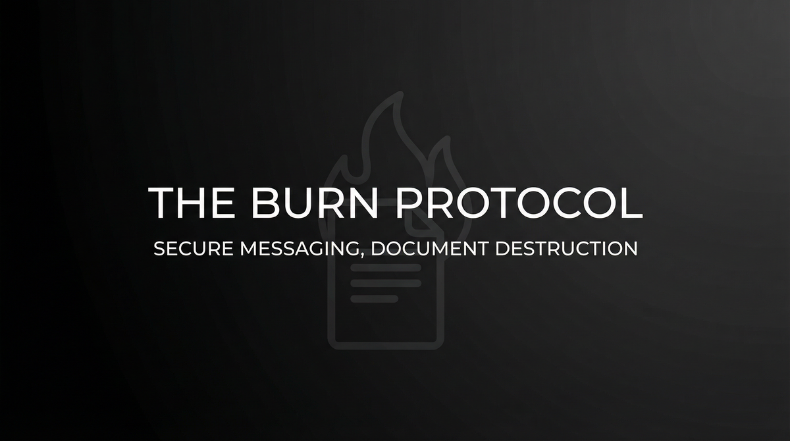

# THE BURN PROTOCOL  
## Capabilities Overview — Product & Services Specification



**Classification:** Client-facing. Capabilities statement.  
**Provider:** DEAD LETTER — Secure Messaging & Document Destruction  
**Last Updated:** Current

---

> *Messages that self-destruct. Documents that dissolve. Channels that never logged. Forensics find nothing. Recovery is impossible.*
>
> ***Send it. Burn it. It never existed.***

---

### Executive Summary

The Burn Protocol is our flagship offering: end-to-end secure messaging with guaranteed destruction on read, plus forensic-grade physical document and device destruction. No server retention. No forensic recovery. We route. You send. The message burns. Documents dissolve. **Nothing remains.**

**We do not ask why. We deliver oblivion.**

---

## I. CORE DEFINITIONS

### Primary Definition
**The Burn Protocol** is a coordinated secure-messaging and document-destruction system that provides ephemeral channels (destruction on read), forensic-grade physical burn services, and guaranteed elimination of recoverable records—ensuring that what was sent or stored never existed.

### One-Sentence Definition
**The Burn Protocol is a multi-tier messaging and destruction system comprising ephemeral channels (no retention), physical document burn, device obliteration, and timed deletion—operating in drop, stream, vault, or full-protocol modes toward complete forensic denial of the client's communications and records.**

**What we offer: the full stack. What you get: it never existed.**

---

## II. THE EXPERIENCE (What the Client Receives)

*This is not encryption. This is erasure.*

You send. The message routes. The recipient reads. The message burns. No copy. No log. No recovery. Forensics find nothing. The server never held it. The channel never logged it. **It never existed.**

Documents. Devices. We burn them. Forensic grade. Recovery impossible. We guarantee it.

**You paid for that. We deliver it.**

---

## II-A. PRICING — What It Costs

### Tiered Service Packages

| Package | Scope | Duration | Price (USD) |
|---------|-------|----------|-------------|
| **DROP** | Single-use channel. One message. One burn. | Per use | **$5,000 – $15,000** |
| **STREAM** | Ongoing secure channel. Timed destruction. Ephemeral. | Monthly | **$25,000 – $75,000 / month** |
| **VAULT** | Document storage with burn-on-demand. Secure hold. | Retainer (annual) | **$100,000 – $300,000 / year** |
| **PROTOCOL** | Full suite. Custom channels. Physical burn. Courier. | Custom | **$500,000+** |

### À La Carte Add-Ons

| Component | Specification | Price Range |
|-----------|---------------|-------------|
| **Physical document destruction** | Forensic grade. Witnessed. | $10,000 – $50,000 |
| **Device wipe** | Guaranteed unrecoverable. | $5,000 – $20,000 |
| **Secure courier** | Hand-carry. Burn on delivery. | $15,000 – $40,000 |
| **Timed deletion** | Schedule. Automated. | $25,000 – $75,000 setup |

---

## III. ARCHITECTURE

### System Type
| Property | Specification |
|----------|---------------|
| **Distribution** | Ephemeral routing; no central store; physical burn infrastructure |
| **Retention** | Zero. Messages destroy on read. Documents burn. |
| **Forensic profile** | Recovery impossible. We guarantee it. |

### Flow
```
Client sends → Route (no store) → Recipient reads → Message burns
Documents/Devices → Physical burn → Obliteration → No recovery
```

---

## IV. CAPABILITIES

### Ephemeral Messaging
| Capability | Specification |
|------------|---------------|
| **Destruction on read** | Message disappears. No copy. No log. |
| **No server retention** | We route. We do not store. |
| **Timed expiration** | Unread messages burn on schedule. |
| **Multi-party** | Group channels. All burn. |

### Physical Burn
| Capability | Specification |
|------------|---------------|
| **Document destruction** | Forensic grade. Witnessed. Certificate. |
| **Device obliteration** | Drive. Phone. Recovery impossible. |
| **Secure courier** | Hand-carry. Burn on delivery. |

---

## V. OPERATIONAL MODES

| Mode | What Happens |
|------|--------------|
| **Drop** | One message. One burn. Single use. |
| **Stream** | Ongoing. Ephemeral. Monthly. |
| **Vault** | Store. Burn on demand. Secure hold. |
| **Protocol** | Full suite. Custom. Physical. |

---

## VI. CLIENT PROFILES

| Profile | Use Case |
|---------|----------|
| **Corporate** | M&A. Litigation. Leak prevention. Board discretion. |
| **Defection** | Communications that cannot exist. |
| **High-net-worth** | Personal. Financial. No record. |
| **Legal** | Privileged. Work product. Burn when done. |

---

## VII. DELIVERABLES

| Deliverable | Outcome |
|-------------|---------|
| **Ephemeral channel** | Send. Burn. No trace. |
| **Burned documents** | Certificate. Gone. |
| **Obliterated devices** | Unrecoverable. Verified. |
| **Clean slate** | What was there is gone. |

---

## VIII. OPERATIONAL BOUNDARIES

| Boundary | Client Note |
|----------|-------------|
| **Third-party retention** | Recipient screenshots—outside our control. Client responsibility. |
| **Legal hold** | We do not retain. Subpoena finds nothing. |
| **Physical custody** | Documents in our custody until burn. Client responsibility pre-transfer. |

---

## IX. ENGAGEMENT — NEXT STEPS

**We assume nothing. We deliver oblivion.**

- Discretion absolute. We do not document. We do not retain.
- Payment in advance. Cryptocurrency or structured finance. No refunds.
- Assessment precedes engagement. No charge for assessment.

---

> *Send it. Burn it. It never existed.*
>
> **Inquire: See [05_INQUIRY_PROTOCOL](./05_INQUIRY_PROTOCOL.md). Discretion assured. Payment in advance.**
