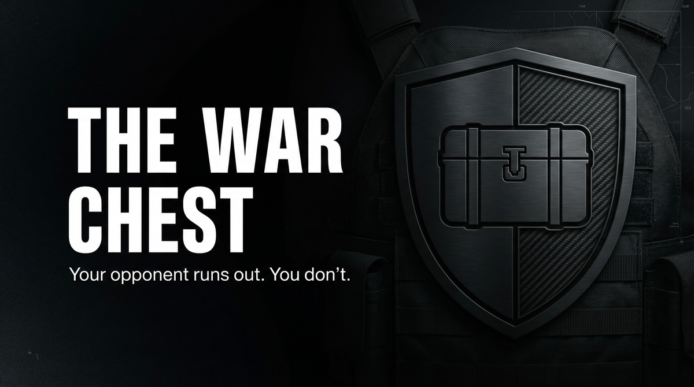

# THE WAR CHEST  
## Capabilities Overview — Product & Services Specification



**Classification:** Client-facing. Capabilities statement.  
**Provider:** DEEP POCKET — Litigation Funding & War Chest Provision  
**Last Updated:** Current

---

> *We fund. You fight. Your opponent runs out. You don't. Outcome-contingent. Deniable. We fund the war.*
>
> ***Your opponent runs out. You don't.***

---

### Executive Summary

The War Chest is our flagship offering: non-recourse litigation funding. We fund. You fight. Your opponent runs out. You don't. Outcome-contingent. Deniable. **Your opponent runs out. You don't.**

**We do not ask why. We deliver funding.**

---

## I. CORE DEFINITIONS

### Primary Definition
**The War Chest** is a litigation funding system that provides non-recourse capital for legal warfare—enabling clients to outlast opponents through outcome-contingent, deniable financing structures.

### One-Sentence Definition
**The War Chest is a multi-tier funding system comprising boost (single campaign), war chest (full funding), and deep (extended) modes—operating toward client financial endurance in legal conflict.**

**What we offer: the full stack. What you get: you outlast.**

---

## II. THE EXPERIENCE (What the Client Receives)

*We fund. You fight. Your opponent runs out. You don't.*

Outcome-contingent. Deniable. Non-recourse. We fund the war. **Your opponent runs out. You don't.**

**You paid for that. We deliver it.**

---

## II-A. PRICING — What It Costs

### Tiered Service Packages

| Package | Scope | Price (USD) |
|---------|-------|-------------|
| **BOOST** | Single campaign. Limited capital. | $500,000 – $2,000,000 |
| **WAR CHEST** | Full funding. Outcome-contingent. | $2,000,000 – $10,000,000 |
| **DEEP** | Extended. Multi-forum. | Custom |

### À La Carte Add-Ons

| Component | Specification | Price Range |
|-----------|---------------|-------------|
| **Capital provision** | Non-recourse. Deniable. | Custom |
| **Outcome structuring** | Contingent. Success fee. | Custom |
| **Endurance financing** | Multi-phase. Extended. | Custom |

---

## III. ARCHITECTURE

### System Type
| Property | Specification |
|----------|---------------|
| **Distribution** | Capital provision; outcome structuring; deniable routing; endurance financing |
| **Retention** | Funding terms. No client identity post-closure. |
| **Forensic profile** | Deniable. Structured. Per regulation. |

### Flow
```
Legal conflict identified → Boost (single campaign)
       ↓
War Chest (full funding, outcome-contingent)
       ↓
Deep (extended, multi-forum)
       ↓
You outlast. Opponent runs out.
```

---

## IV. CAPABILITIES

### Capital Provision
| Capability | Specification |
|------------|---------------|
| **Non-recourse** | No personal guarantee. Outcome-contingent. |
| **Deniable** | Structured. Opaque. |
| **Scale** | $500K to $10M+. |

### Outcome Structuring
| Capability | Specification |
|------------|---------------|
| **Success fee** | Contingent on outcome. |
| **Milestone** | Phased. Conditional. |

### Endurance Financing
| Capability | Specification |
|------------|---------------|
| **Multi-phase** | Extended conflict. |
| **Multi-forum** | Litigation. Regulatory. |

---

## V. OPERATIONAL MODES

| Mode | What Happens |
|------|--------------|
| **Boost** | Single campaign. Limited capital. |
| **War Chest** | Full funding. Outcome-contingent. |
| **Deep** | Extended. Multi-forum. |

---

## VI. CLIENT PROFILES

| Profile | Use Case |
|---------|----------|
| **Litigation** | Plaintiff. Defendant. Opposition outlast. |
| **Regulatory** | Agency. Compliance. Extended. |
| **Corporate dispute** | M&A. Partnership. Contract. |
| **High-stakes** | Outcome-critical. Endurance required. |

---

## VII. DELIVERABLES

| Deliverable | Outcome |
|-------------|---------|
| **Capital** | Deployed. Deniable. |
| **Structure** | Outcome-contingent. Non-recourse. |
| **Endurance** | You fight. Opponent runs out. |

---

## VIII. OPERATIONAL BOUNDARIES

| Boundary | Client Note |
|----------|-------------|
| **Case merit** | Subject to assessment. |
| **Jurisdiction** | Funding structures per local regulation. |
| **Outcome** | No guarantee. Contingent terms apply. |
| **Counsel** | Coordination with trial counsel required. |

---

## IX. ENGAGEMENT — NEXT STEPS

**We assume nothing. We deliver funding.**

- Discretion absolute. We do not document. We do not retain.
- Payment terms per agreement. Case assessment precedes commitment.
- No charge for assessment.

---

> *Your opponent runs out. You don't.*
>
> **Inquire: See [05_INQUIRY_PROTOCOL](./05_INQUIRY_PROTOCOL.md). Discretion assured.**
