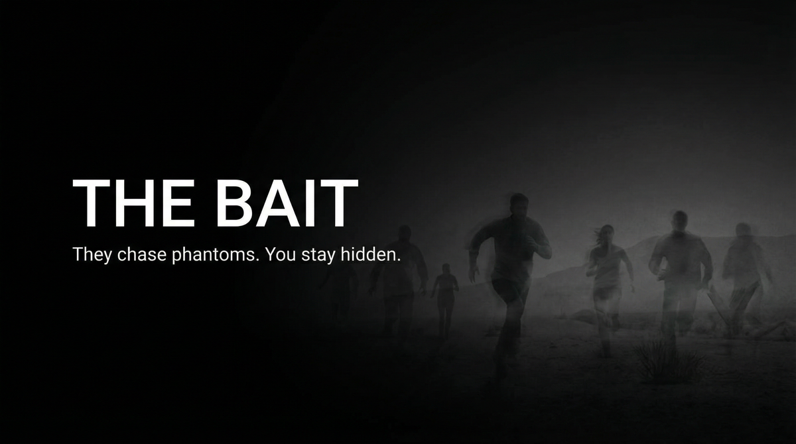

# THE BAIT  
## Capabilities Overview — Product & Services Specification



**Classification:** Client-facing. Capabilities statement.  
**Provider:** FALSE DOOR — Decoy Operations & Misdirection  
**Last Updated:** Current

---

> *Investigators chase false leads. Resources burn. The real target stays hidden. The trail goes nowhere. They chase phantoms. You stay hidden.*
>
> ***They chase phantoms. You stay hidden.***

---

### Executive Summary

The Bait is our flagship offering: decoy deployment and misdirection. Investigators chase false leads. Resources burn. The real target stays hidden. The trail goes nowhere. **They chase phantoms. You stay hidden.**

**We do not ask why. We deliver misdirection.**

---

## I. CORE DEFINITIONS

### Primary Definition
**The Bait** is a decoy and misdirection system that deploys false targets, fabricated trails, and phantom leads—consuming investigator resources while the real subject remains undiscovered.

### One-Sentence Definition
**The Bait is a multi-tier misdirection system comprising single (one decoy), bait (coordinated), and door (extended) modes—operating toward investigator diversion and resource burn.**

**What we offer: the full stack. What you get: they chase phantoms.**

---

## II. THE EXPERIENCE (What the Client Receives)

*Investigators chase false leads. Resources burn. The real target stays hidden.*

The trail goes nowhere. Phantom leads. Fabricated evidence. They chase phantoms. You stay hidden. **They chase phantoms. You stay hidden.**

**You paid for that. We deliver it.**

---

## II-A. PRICING — What It Costs

### Tiered Service Packages

| Package | Scope | Price (USD) |
|---------|-------|-------------|
| **SINGLE** | One decoy. One false trail. | $75,000 – $200,000 |
| **BAIT** | Coordinated. Multi-lead. | $300,000 – $750,000 |
| **DOOR** | Extended. Full misdirection. | $1,000,000 – $3,000,000 |

### À La Carte Add-Ons

| Component | Specification | Price Range |
|-----------|---------------|-------------|
| **Decoy deployment** | One. Fabricated. | $50,000 – $150,000 |
| **False trail** | Documents. Digital. Physical. | $75,000 – $200,000 |
| **Resource burn** | Multiple leads. Coordinated. | $150,000 – $400,000 |

---

## III. ARCHITECTURE

### System Type
| Property | Specification |
|----------|---------------|
| **Distribution** | Decoy deployment; false trail fabrication; resource burn; narrative control |
| **Retention** | No operational record. All material fabricated. |
| **Forensic profile** | Decoys are phantoms. Real target hidden. |

### Flow
```
Investigation active → Single (one decoy)
       ↓
Bait (coordinated, multi-lead)
       ↓
Door (extended, full misdirection)
       ↓
They chase phantoms. You stay hidden.
```

---

## IV. CAPABILITIES

### Decoy Deployment
| Capability | Specification |
|------------|---------------|
| **False target** | Fabricated. Credible. |
| **Phantom lead** | Investigators follow. |

### False Trail Fabrication
| Capability | Specification |
|------------|---------------|
| **Documents** | Forged. Plausible. |
| **Digital** | Footprint. Trail. |
| **Physical** | Evidence. Artifacts. |

### Resource Burn
| Capability | Specification |
|------------|---------------|
| **Multi-lead** | Investigators split. |
| **Narrative control** | Story bends. Trail diverts. |

---

## V. OPERATIONAL MODES

| Mode | What Happens |
|------|--------------|
| **Single** | One decoy. One false trail. |
| **Bait** | Coordinated. Multi-lead. |
| **Door** | Extended. Full misdirection. |

---

## VI. CLIENT PROFILES

| Profile | Use Case |
|---------|----------|
| **Litigation** | Opposition investigation. Discovery. |
| **Regulatory** | Agency probe. Diversion. |
| **Criminal** | Defense. Investigation stall. |
| **Corporate** | Leak. M&A. Competitor. |

---

## VII. DELIVERABLES

| Deliverable | Outcome |
|-------------|---------|
| **Decoy** | Deployed. Investigators follow. |
| **False trail** | Fabricated. Credible. |
| **Resource burn** | Investigators diverted. |
| **Real target** | Hidden. Undiscovered. |

---

## VIII. OPERATIONAL BOUNDARIES

| Boundary | Client Note |
|----------|-------------|
| **Investigator behavior** | Effectiveness depends on response. |
| **Permanent diversion** | No guarantee. |
| **Fabricated material** | All decoy material is fabricated. |
| **Jurisdiction** | Material placement subject to local law. |

---

## IX. ENGAGEMENT — NEXT STEPS

**We assume nothing. We deliver misdirection.**

- Discretion absolute. We do not document. We do not retain.
- Payment in advance. Misdirection strategy evaluated at intake.
- No charge for assessment.

---

> *They chase phantoms. You stay hidden.*
>
> **Inquire: See [05_INQUIRY_PROTOCOL](./05_INQUIRY_PROTOCOL.md). Discretion assured. Payment in advance.**
