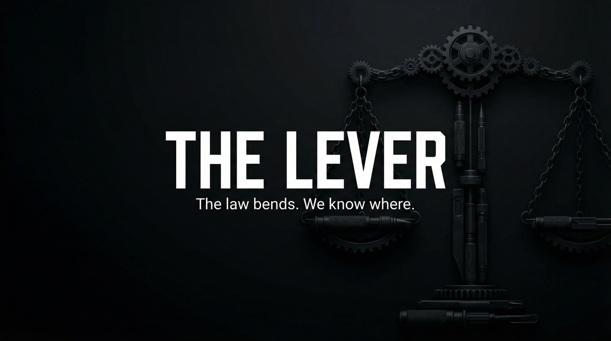

# THE LEVER  
## Capabilities Overview — Product & Services Specification



**Classification:** Client-facing. Capabilities statement.  
**Provider:** GRAY AREA — Legal Warfare & Procedural Manipulation  
**Last Updated:** Current

---

> *Merit does not always win. Process does. We work the machinery. Delay. Leverage. Outcome.*
>
> ***The law bends. We know where.***

---

### Executive Summary

The Lever is our flagship offering: coordinated legal pressure, procedural delay, and outcome engineering. We do not litigate. We manipulate process—delay, venue, discovery, leverage—so the system produces the outcome you need. **The law bends. We know where.**

**We do not ask why. We deliver leverage.**

---

## I. CORE DEFINITIONS

### Primary Definition
**The Lever** is a coordinated legal warfare system that manipulates procedure—delay, venue, discovery, leverage—to produce favorable outcomes without litigating merits. Process is the weapon. Outcome is the deliverable.

### One-Sentence Definition
**The Lever is a multi-tier procedural manipulation system comprising assess, tactical, lever, and siege modes—operating through delay, venue, discovery, and leverage engineering toward outcome control in litigation, regulatory, and corporate contexts.**

**What we offer: the full stack. What you get: the law bends.**

---

## II. THE EXPERIENCE (What the Client Receives)

*Merit does not always win. Process does.*

Delay. Venue. Discovery. Leverage. The machinery bends. The system produces the outcome you need. We work the procedure. Counsel coordinates. **The law bends. We know where.**

**You paid for that. We deliver it.**

---

## II-A. PRICING — What It Costs

### Tiered Service Packages

| Package | Scope | Price (USD) |
|---------|-------|-------------|
| **ASSESS** | Leverage map. Pressure points. Strategy. | $50,000 – $150,000 |
| **TACTICAL** | Per-action. Delay. Venue. Discovery. | $75,000 – $200,000 |
| **LEVER** | Full campaign. Coordinated. Outcome focus. | $300,000 – $1,000,000 |
| **SIEGE** | Multi-forum. Extended. Settlement control. | Custom |

### À La Carte Add-Ons

| Component | Specification | Price Range |
|-----------|---------------|-------------|
| **Procedural delay** | Motion practice. Continuances. | $25,000 – $75,000 |
| **Venue engineering** | Transfer. Forum selection. | $50,000 – $150,000 |
| **Discovery leverage** | Scope. Timing. Cost pressure. | $75,000 – $200,000 |
| **Regulatory gaming** | Procedural routes. Timing. | Custom |

---

## III. ARCHITECTURE

### System Type
| Property | Specification |
|----------|---------------|
| **Distribution** | Procedural delay; leverage engineering; outcome influence; regulatory gaming |
| **Retention** | Strategy retained during engagement. No post-closure record. |
| **Forensic profile** | All actions within legal bounds. Coordination with client counsel. |

### Flow
```
Client objective → Assess (leverage map, pressure points)
       ↓
Tactical (delay, venue, discovery)
       ↓
Lever (full campaign, coordinated)
       ↓
Siege (multi-forum, settlement control)
       ↓
Outcome engineered. Process bent.
```

---

## IV. CAPABILITIES

### Procedural Delay
| Capability | Specification |
|------------|---------------|
| **Motion practice** | Continuances. Extensions. Cost burn. |
| **Discovery timing** | Scope control. Staggered. |
| **Scheduling** | Venue. Calendar. Pressure. |

### Leverage Engineering
| Capability | Specification |
|------------|---------------|
| **Pressure points** | Identified. Exploited. |
| **Outcome influence** | Settlement. Dismissal. Favorable terms. |
| **Regulatory gaming** | Procedural routes. Timing. |

---

## V. OPERATIONAL MODES

| Mode | What Happens |
|------|--------------|
| **Assess** | Leverage map. Pressure points. Strategy. |
| **Tactical** | Per-action. Delay. Venue. Discovery. |
| **Lever** | Full campaign. Coordinated. Outcome focus. |
| **Siege** | Multi-forum. Extended. Settlement control. |

---

## VI. CLIENT PROFILES

| Profile | Use Case |
|---------|----------|
| **Litigation** | Opposition pressure. Settlement. Dismissal. |
| **Regulatory** | Procedural routes. Timing. Compliance pressure. |
| **Corporate dispute** | M&A. Partnership. Contract. |
| **High-stakes** | Reputation. Assets. Outcome-critical. |

---

## VII. DELIVERABLES

| Deliverable | Outcome |
|-------------|---------|
| **Leverage map** | Pressure points. Strategy. |
| **Procedural action** | Delay. Venue. Discovery. |
| **Campaign execution** | Coordinated. Outcome-focused. |
| **Outcome** | Favorable. Engineered. |

---

## VIII. OPERATIONAL BOUNDARIES

| Boundary | Client Note |
|----------|-------------|
| **Legal bounds** | All actions within law. No guarantees. |
| **Counsel coordination** | Required. We work with your lawyers. |
| **Merit** | We manipulate process. Merit is your concern. |
| **Jurisdiction** | Rules vary. Advise forum. |

---

## IX. ENGAGEMENT — NEXT STEPS

**We assume nothing. We deliver leverage.**

- Discretion absolute. We do not document. We do not retain.
- Payment in advance. Counsel coordination required.
- Assessment precedes engagement. No charge for assessment.

---

> *The law bends. We know where.*
>
> **Inquire: See [05_INQUIRY_PROTOCOL](./05_INQUIRY_PROTOCOL.md). Discretion assured. Payment in advance.**
