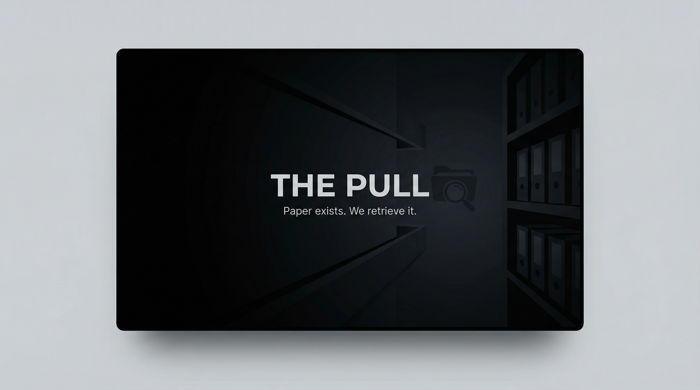

# THE PULL  
## Capabilities Overview — Product & Services Specification



**Classification:** Client-facing. Capabilities statement.  
**Provider:** HARD COPY — Physical Document Acquisition  
**Last Updated:** Current

---

> *Archives. Vaults. Secure locations. We gain access. We retrieve. You receive. Paper exists. We get it.*
>
> ***Paper exists. We retrieve it.***

---

### Executive Summary

The Pull is our flagship offering: physical document acquisition from secure locations. Archives. Vaults. We gain access. We retrieve. You receive. **Paper exists. We retrieve it.**

**We do not ask why. We deliver.**

---

## I. CORE DEFINITIONS

### Primary Definition
**The Pull** is a physical document acquisition system that gains access to secured locations—archives, vaults, filing systems—and retrieves specified documents or artifacts for client delivery.

### One-Sentence Definition
**The Pull is a multi-tier acquisition system comprising single (one target), pull (multi-document), and deep-pull (extended access) modes—operating toward physical document delivery.**

**What we offer: the full stack. What you get: the documents.**

---

## II. THE EXPERIENCE (What the Client Receives)

*Archives. Vaults. Secure locations.*

We gain access. We retrieve. You receive. Paper exists. We get it. **Paper exists. We retrieve it.**

**You paid for that. We deliver it.**

---

## II-A. PRICING — What It Costs

### Tiered Service Packages

| Package | Scope | Price (USD) |
|---------|-------|-------------|
| **SINGLE** | One location. One document set. | $50,000 – $150,000 |
| **PULL** | Multi-location. Extended retrieval. | $200,000 – $500,000 |
| **DEEP PULL** | Long-term access. Full archive. | $750,000 – $2,000,000 |

### À La Carte Add-Ons

| Component | Specification | Price Range |
|-----------|---------------|-------------|
| **Access engineering** | One location. One entry. | $25,000 – $75,000 |
| **Document retrieval** | Copy. Extract. Secure handoff. | $50,000 – $150,000 |
| **Multi-location** | Extended. Coordinated. | $150,000 – $400,000 |

---

## III. ARCHITECTURE

### System Type
| Property | Specification |
|----------|---------------|
| **Distribution** | Access engineering; document retrieval; copy/extract; secure handoff |
| **Retention** | Documents delivered. No operational copy. |
| **Forensic profile** | Chain of custody. Per jurisdiction. |

### Flow
```
Target identified → Single (one location)
       ↓
Pull (multi-location, extended)
       ↓
Deep pull (long-term, full archive)
       ↓
Documents delivered. Secure handoff.
```

---

## IV. CAPABILITIES

### Access Engineering
| Capability | Specification |
|------------|---------------|
| **Physical entry** | Archives. Vaults. Secured. |
| **Bypass** | Locks. Alarms. Access control. |

### Document Retrieval
| Capability | Specification |
|------------|---------------|
| **Copy** | Photograph. Scan. Extract. |
| **Secure handoff** | Chain of custody. Verified. |

---

## V. OPERATIONAL MODES

| Mode | What Happens |
|------|--------------|
| **Single** | One location. One document set. |
| **Pull** | Multi-location. Extended retrieval. |
| **Deep Pull** | Long-term access. Full archive. |

---

## VI. CLIENT PROFILES

| Profile | Use Case |
|---------|----------|
| **Litigation** | Discovery. Evidence. Opposition. |
| **Corporate** | M&A. Due diligence. Archives. |
| **Defection** | Pre-exit. Documents. |
| **Evidence** | Physical. Chain of custody. |

---

## VII. DELIVERABLES

| Deliverable | Outcome |
|-------------|---------|
| **Documents** | Retrieved. Verified. Delivered. |
| **Copy/extract** | Photograph. Scan. |
| **Secure handoff** | Chain of custody. |

---

## VIII. OPERATIONAL BOUNDARIES

| Boundary | Client Note |
|----------|-------------|
| **Physical access** | Limits apply. Assess at intake. |
| **Document status** | Destroyed or moved—no guarantee. |
| **Jurisdiction** | All actions within legal bounds per forum. |
| **Custody** | Client responsibility post-delivery. |

---

## IX. ENGAGEMENT — NEXT STEPS

**We assume nothing. We deliver.**

- Discretion absolute. We do not document. We do not retain.
- Payment in advance. Target feasibility evaluated at intake.
- No charge for assessment.

---

> *Paper exists. We retrieve it.*
>
> **Inquire: See [05_INQUIRY_PROTOCOL](./05_INQUIRY_PROTOCOL.md). Discretion assured. Payment in advance.**
