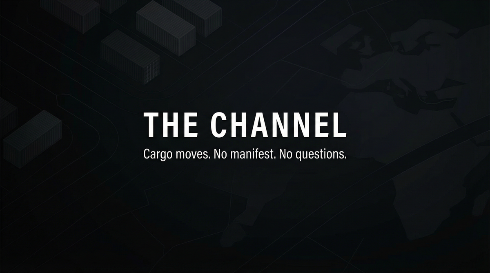

# THE CHANNEL  
## Capabilities Overview — Product & Services Specification

**Classification:** Client-facing. Capabilities statement.  
**Provider:** NIGHT RUN — Deniable Logistics & Cargo Movement  
**Last Updated:** Current

---

> *Cargo moves. Handoffs occur. No manifest. No questions. We route. You receive. Deniable. End-to-end.*
>
> ***Cargo moves. No manifest. No questions.***

---

### Executive Summary

The Channel is our flagship offering: end-to-end deniable logistics. Cargo moves through handoffs. No manifest. No questions. We route. You receive. **Deniable. End-to-end.**

**We do not ask what. We deliver movement.**

---

## I. CORE DEFINITIONS

### Primary Definition
**The Channel** is a deniable logistics system that moves cargo through coordinated handoffs, opaque routing, and manifest-free transit—delivering goods from origin to destination with no paper trail and no questions.

### One-Sentence Definition
**The Channel is a multi-tier logistics system comprising single shipment, channel (recurring route), and pipeline (annual) modes—operating toward deniable cargo delivery at designated destination.**

**What we offer: the full stack. What you get: cargo arrives.**

---

## II. THE EXPERIENCE | II-A. PRICING

| Tier | Scope | Price (USD) |
|------|-------|-------------|
| **SINGLE** | One shipment. End-to-end. Deniable. | $75,000 – $200,000 |
| **CHANNEL** | Recurring route. Ongoing handoffs. | $300,000 – $750,000 |
| **PIPELINE** | Annual. Multiple shipments. Capacity reserved. | $1,000,000 – $3,000,000/yr |

**Capabilities:** Deniable routing; Handoffs; Manifest-free transit; Capacity management. **Boundaries:** Cargo restrictions apply. No guarantee against interception.

---

## IX. ENGAGEMENT

**We assume nothing. We deliver movement.** Payment in advance. Cargo type and route feasibility evaluated at intake.

---

> *Cargo moves. No manifest. No questions.*
>
> **Inquire: See [05_INQUIRY_PROTOCOL](./05_INQUIRY_PROTOCOL.md). Discretion assured. Payment in advance.**
