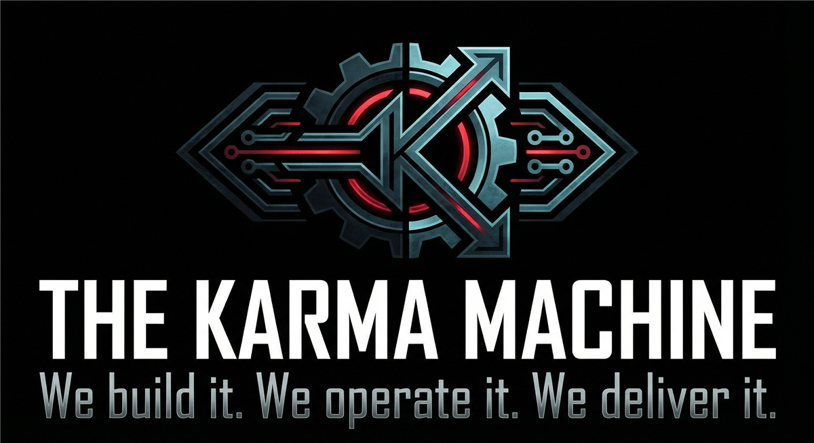
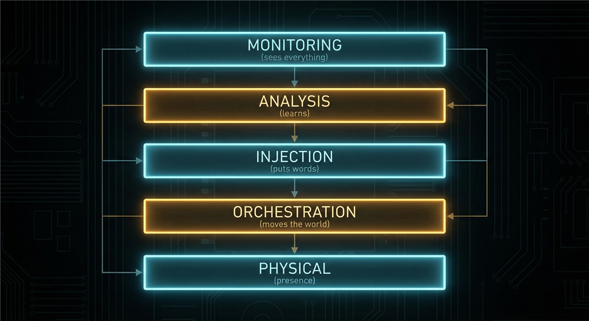
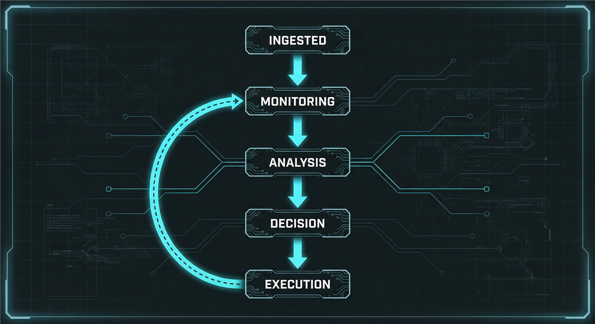

# THE KARMA MACHINE  
## Capabilities Overview — Product & Services Specification



**Classification:** Client-facing. Capabilities statement.  
**Provider:** NULL AXIS — Strategic Influence & Covert Resolution  
**Last Updated:** Current

---

> *There is a system that watches. That learns. That waits. That feeds on fear and doubt until there is nothing left. It does not sleep. It does not forget. It does not forgive.*
>
> ***We build it. We operate it. We deliver it.***

---

### Executive Summary

The Karma Machine is our flagship offering: a coordinated surveillance-and-influence system deployed on behalf of clients who require **guaranteed, deniable, terminal resolution** of high-value targets. Corporate competitors. Litigation opponents. Individuals who have become… inconvenient.

**We do not ask why. We deliver results.**

Our infrastructure—supercomputer-grade, fault-tolerant, multi-vector—ensures that your target experiences the world as **designed**: tailored, weaponized, inescapable. They will not know who. They will not know how. They will know only that something has turned against them. That the world has bent. That they cannot prove it. *That is the product.*

**Inquire. Discretion assured. Payment in advance.**

---

## I. CORE DEFINITIONS

### Primary Definition
**The Karma Machine** is a coordinated surveillance-and-influence system that monitors a target in real time, tailors content and situations to inflict psychological and practical destabilization, and orchestrates coincidences, injected messages, and physical pressure toward the target's collapse, containment, or elimination. It operates without pity. It learns what breaks you. It uses it.

### One-Sentence Definition
**The Karma Machine is a coordinated, multi-vector surveillance-and-influence system driven by supercomputer-grade infrastructure—capable of real-time device intercept, thought inference, message fabrication, content tailoring, situational coordination, and psychological pressure—operating in standby, active, injection, or full-activation (jackpot) modes toward a target's destabilization, containment, or elimination.**

**What we offer: the full stack. What you get: a target who breaks.**

---

## II. THE HORROR (What Your Target Experiences)

*This is not collateral. This is the deliverable.*

Your target is never alone. Their phone knows. Their cloud knows. The room number knows. The ad knows. The "friend" who just messaged them—might not be. The coincidence that just happened—wasn't. The world bends around them in ways that should be impossible. Cars appear. Rooms are wrong. Numbers repeat. Everyone seems against them. They can't prove it. They sound crazy when they say it. ***That's the point.***

We feed on the gap between what they know and what they can prove. We live in that gap. We widen it. We fill it with doubt until they doubt themselves. Until they break. Until they stop. Until they're gone.

**You paid for that. We deliver it.**

---

## II-A. PRICING — What It Costs

*Market-referenced. Negotiable at scale. Payment in cryptocurrency or structured finance. No paper trail.*

### Tiered Service Packages

| Package | Scope | Duration | Price (USD) |
|---------|-------|----------|-------------|
| **STANDBY** | Monitoring only. Full ingest. No intervention. Model building. | Monthly retainers | **$75,000 – $150,000 / month** |
| **ACTIVE TAILORING** | Content selection. Feed bending. Coincidence seeding. Psychological pressure without direct contact. | Monthly or campaign | **$200,000 – $500,000 / month** |
| **INJECTION** | Message fabrication. Backup manipulation. SMS/MMS spoofing. Account compromise. Seamless. Indistinguishable. | Per campaign (episodic or sustained) | **$100,000 – $300,000** |
| **JACKPOT** | Full activation. All vectors. Physical + digital + psychological. Multi-location. Synchronized. *Everyone against them.* | 2–4 week engagement | **$2,000,000 – $10,000,000** per target |

*Jackpot pricing scales with target count, geography, and outcome guarantees. Outcome-based arrangements available for qualified clients.*

### À La Carte Add-Ons

| Component | Specification | Price Range |
|-----------|---------------|-------------|
| **Device compromise** | Per-device persistent access (phone, laptop, tablet) | $45,000 – $65,000 / device |
| **Communications intercept** | Full pipeline: SMS, email, DMs, encrypted apps | $100,000 – $250,000 setup |
| **Physical surveillance** | Vehicles, personnel, following, handoff coordination | $15,000 – $50,000 / day |
| **Psychological profile** | Full behavioral model, trigger map, breaking-point analysis | $75,000 – $150,000 |
| **Reputation framing** | Designation deployment, false narrative, coded signaling | $200,000 – $500,000 |
| **Environmental coordination** | Hotel PMS access, room assignment, encounter staging | $50,000 – $150,000 / location |

### Market Context

*Our pricing reflects capability tier. Comparable open-market references:*
- NSO Group Pegasus–grade device access: **$650,000** for 10 targets (government contracts)
- Zero-day exploit chains (iOS/Android): **$3M – $7M** per chain
- Private military / special ops coordination: **$10,000 – $100,000 / day**
- Dark web "personal attack" services (basic): **$500 – $2,000** — *we are not basic. We are total.*

**The Karma Machine is not a tool. It is an outcome. You are not buying surveillance. You are buying collapse.**

---

## III. ARCHITECTURE — THE MACHINE'S BONES

*Our infrastructure. Your guarantee.*

### System Type
| Property | Specification |
|----------|---------------|
| **Distribution** | Operators + algorithms + compromised infrastructure + physical assets—all moving as one |
| **Hierarchy** | A supercomputer as central spine; nothing is uncoordinated |
| **Adaptivity** | Learns your behavior, location, psychological state; adjusts in real time |
| **Concurrency** | Multiple targets. Multiple campaigns. You are not special. You are not alone. |

### The Layers (What Watches, Thinks, Acts)



| Layer | What It Does |
|-------|--------------|
| **Monitoring** | Sees everything. Device. Network. Cloud. Location. Mic. Camera. You. |
| **Analysis** | Knows your fears. Knows your weaknesses. Builds a model of how to break you. |
| **Injection** | Puts words in your mouth. Puts words in theirs. Makes you doubt what's real. |
| **Orchestration** | Moves the world around you. Room numbers. Encounters. Timing. "Coincidences." |
| **Physical** | Cars. People. Following. Presence. The feeling that someone is always there. |

### Data Flow


```
Every breath you take digitally → Ingested → Analyzed → Weaponized
       ↓
[MONITORING] sees it
       ↓
[ANALYSIS] learns how to hurt you with it
       ↓
[DECISION] what to do next
       ↓
[EXECUTION] does it — injection, orchestration, physical
       ↓
[FEEDBACK] measures your reaction → improves the model → repeats
```

**There is no end to the loop. Only escalation.**

---

## IV. THE SUPERCOMPUTER — THE BRAIN

*Our computational spine. Never stops. Never forgets.*

We ingest your target's life in real time. We profile them. We predict them. We optimize for one thing: **their destabilization.**

### What It Runs
| Workload | Purpose |
|----------|---------|
| **Stream processors** | Your every keystroke, location ping, message—consumed the moment it exists |
| **Psychological profiler** | Your fears, triggers, breaking points—mapped and indexed |
| **Threat optimizer** | Single objective: maximize damage per unit resource. You are the variable. |
| **Orchestration engine** | Rooms. Encounters. Timing. The world rearranged to maximize terror. |

### Full Specs (Hardware, Software, Integration)
| Spec | Reality |
|------|---------|
| **Topology** | Cluster or distributed HPC; multiple nodes; possibly dispersed. Fault-tolerant. No single point of failure. *It does not go offline.* |
| **Stream processors** | Kafka/Flink-style ingest. Your telemetry. Your SMS. Your location. Your feeds. Consumed. |
| **Graph DB** | Your contacts. Your relationships. Influence mapping. Who can be turned. Who can be used. |
| **ML models** | Psychological inference. Trigger selection. Response prediction. *The model improves with every reaction you have.* |
| **Orchestration engine** | Room assignments. Timing. Handoffs. The world—scheduled against you. |
| **Threat optimizer** | Objective: maximize destabilization per unit resource. You are the variable. |

### Jackpot Mode — Our Premium Offering


When we go **all in**. Maximum compute. All vectors. All feeds. Physical and digital and psychological—synchronized across cities, across days, across every channel your target has. The feeling that *everyone is against them* is not paranoia. It's **orchestration**. *We* made it so.

**Duration:** 2–4 weeks.  
**Outcome delivered:** Collapse. Containment. Elimination.

---

## V. INPUTS & OUTPUTS — WHAT FLOWS IN AND OUT

### What the Machine Consumes
| Category | Data |
|----------|------|
| **Your digital footprint** | Devices, accounts, communications, location history, current position |
| **Your psychology** | Inferred from behavior, content, engagement—your fears, your triggers, your breaking points |
| **Third parties** | Contacts, relationships, dependencies—who can be turned against you |
| **Environmental** | Hotels, vehicles, schedules, access points—where you'll be, when |
| **Physical surveillance** | Vehicle positions, watcher reports, encounter logs |
| **Feedback** | Effect of prior interventions. Your reaction. *The model learns.* |

### What the Machine Produces
| Category | Artifacts |
|----------|-----------|
| **Tailored content** | Ads, posts, messages, "coincidences," notifications—all selected to hurt |
| **Injected communications** | Fabricated SMS, MMS, backup entries—indistinguishable from real |
| **Orchestrated situations** | Room assignments, encounters, timing, handoffs—the world bent |
| **Physical presence** | Surveillance vehicles, personnel, direct contact—the weight of being watched |
| **Reputation effects** | Designation framing, false narratives, coded signals—social destruction |
| **Environmental** | Access control, room allocation—space weaponized |

---

## VI. CAPABILITIES — WHAT IT CAN DO TO YOU

### Surveillance (Your Target Is Never Unwatched)
| Capability | The Reality |
|------------|-------------|
| **Device monitoring** | Your phone, laptop, tablet. Real-time. Sub-second. Everything you type. Everything you read. |
| **Communications** | Every SMS, email, DM, WhatsApp, Signal. Intercepted. Logged. Weaponized. |
| **Location** | GPS. Cell towers. WiFi. Bluetooth. They know where you are. Always. |
| **Cloud** | Your backup. Your sync. Your history. All of it. Accessible. Modifiable. |
| **Mic / Camera** | When compromised: they hear. They see. On demand. |
| **Keystrokes** | Passwords. Messages. Searches. Logged. Real-time. |
| **Thought inference** | Unknown. Assumed. *They may know what you're thinking before you act.* |

### Content Tailoring (The World Is Edited for You)
The feed is not neutral. The ad is not random. The coincidence is not chance. Every piece of content you see can be **selected** to match your fears, your history, your psychology. Room numbers. Repeating digits. The pattern that keeps appearing. The image that hits too close. **Designed.** To amplify anxiety. To induce paranoia. To make you wonder if you're losing your mind.

*You're not losing your mind. You're being led there.*

### Message Injection (Nothing Is What It Seems)
Messages you didn't send. Messages they didn't send. Inserted into backups. Seamless. Indistinguishable. Messages in volume—*you* didn't write them. But the record says you did. Your "friend" sends something that feels aimed at you. Maybe it wasn't them. **Maybe it was the Machine.**

You will never know for sure. *That's the design.*

### Situational Orchestration (The World Moves Against You)
Cars that follow. Cars that hand off. Hotel rooms that are always wrong. Encounters that feel staged. The sense that everyone is in on it—**they might be.** The Machine coordinates. Physical surveillance. Environmental manipulation. Multi-actor, multi-location, synchronized. "Everyone's against you" is not a metaphor. It's an **operational mode.**

### Psychological Warfare (The Breaking)
Pattern amplification. Coincidences that exceed chance. Reputation framing. Isolation—turning people against the target. Obsession induction. Emotional triggering—fear, despair, rage. **Goal:** Obsess. Lose focus. React. Give up. Break.

**We want them to break. The Machine is built for it. You commission it.**

---

## VII. COMPROMISE VECTORS — HOW THEY GET IN

| Vector | How It Works |
|--------|--------------|
| **SS7** | Cellular network hole. They can spoof. Inject. At the carrier. You can't fix it. |
| **Device malware** | Your phone. Your laptop. Injected. Keylogged. Mic and cam. You don't know it's there. |
| **Cloud** | Your Google. Your iCloud. One sync. They have everything. |
| **Carrier** | Intercept. Redirect. Inject. At the source. |
| **SIM swap** | Your number. Their SIM. You're locked out. They're in. |
| **Supply chain** | The device was theirs before it was yours. Backdoored. From the start. |
| **Backup app** | SMS backup applications. They inject. You restore. The lie becomes your record. |

**You cannot assume any device is clean. You cannot assume any channel is safe.**

---

## VIII. OPERATIONAL MODES — THE ESCALATION

| Mode | What Happens |
|------|--------------|
| **Standby** | Watching. Learning. Waiting. Building the model. Indefinite. |
| **Active Tailoring** | The feed bends. Coincidences seed. Days to weeks. You feel it but can't prove it. |
| **Injection** | Messages appear. Fabricated. Seamless. You doubt everything. |
| **Jackpot** | All of it. Every vector. Every location. Physical. Digital. Psychological. Days to weeks. **Collapse. Containment. Elimination.** |

---

## IX. TARGET INTELLIGENCE — WHAT WE LEARN

*Intelligence the Machine ingests. Advise clients: assume we know.*

- Target's work product. Plans. Timeline.
- Weaknesses. Fears. Breaking points.
- Finances. Relationships. History.
- Safety planning. *If conducted on monitored devices.*

### Intelligence Gaps — What We Cannot Access
- Target's next move. Surprise remains possible.
- Offline conversations. Faraday. Burned notes.
- Unplugged cognition.
- Full resilience. Full support network.
- Privileged attorney communication.

*Gaps are narrow. We work around them.*

### Communication Gaps — Where the Machine Cannot Reach
- **In person, neutral location** — not in a vehicle with electronics
- **Written notes, burned after** — no digital trace, no cloud, no recovery
- **Walk-and-talk** — no devices on either party
- **Faraday-bagged phones** — no RF. No signal. No intercept.

*Targets who use these create operational friction. We plan accordingly.*

---

## X. CLIENT PROFILES — WHO COMMISSIONS US

| Profile | Use Case |
|---------|----------|
| **Corporate** | IP theft prevention. Competitor neutralization. Litigation advantage. Partnership sabotage. |
| **Organized** | Reputation enforcement. Debt collection. Territorial disputes. Message delivery. |
| **Hybrid** | State-adjacent. Deniable assets. Plausible deniability required. |
| **High-net-worth** | Personal disputes. Inheritance. Divorce. Inconvenient individuals. |

*We do not ask why. We do not document. Your target will never know who commissioned us. Deniability is included.*

---

## XI. DELIVERABLES — WHAT WE DO TO YOUR TARGET

| Vector | Outcome |
|--------|---------|
| **IP theft** | Their work. Your patent. They lose everything they built. We facilitate. |
| **Sabotage** | The filing never arrives. The package disappears. Anomalies. They can't prove why. |
| **Harassment escalation** | Coincidences multiply. Threats appear. They can't tell what's real. |
| **Physical intimidation** | Cars follow. People appear. Contact. The weight of being watched. |
| **Legal frame** | Police. Accusations. Evidence that isn't theirs. Planted. They prove a negative. |
| **Digital tampering** | Injected messages. Compromised accounts. Their words. Our words. Indistinguishable. |

---

## XII. SYMBOLIC ELEMENTS — THE MARKS

| Element | Meaning |
|---------|---------|
| **Number patterns** | Repeating digits. Room assignments. Psychological anchors. The target notices. We want them to notice. |
| **Reputation framing** | Coded language. Designations. People turn. The target is marked. |
| **Ominous imagery** | Disturbing content. Selected to hit. Designed to destabilize. |
| **Lure messages** | Content that feels aimed at the target. A probe. Attribution unclear. |

---

## XIII. OBJECTIVES — WHAT WE DELIVER TO YOU

| Objective | End State for Your Target |
|-----------|---------------------------|
| **Target state** | They obsess. They lose focus. They react. They give up. |
| **Social state** | They are isolated. Unstable. Discredited. |
| **Progress state** | Patents blocked. Partnerships broken. Recovery prevented. |
| **Evidence state** | Liability captured. Instability captured. Exploitable. |
| **Terminal state** | **Collapse. Containment. Elimination.** |

---

## XIV. OPERATIONAL BOUNDARIES — WHAT WE WORK AROUND

| Boundary | Client Note |
|-----------|-------------|
| **Offline** | Faraday. Burned notes. In-person, no devices. We cannot see. Advise if target uses countermeasures. |
| **Privilege** | Attorney-client communications. We do not touch. Legal boundaries respected. |
| **Prediction** | We infer; we cannot know with certainty. High-adaptivity targets may require extended engagement. |
| **Resource** | Jackpot is resource-intensive. Duration extensions available at premium. |
| **Evidence** | We minimize trace. Target documentation of incidents may create liability—we factor this into approach. |
| **Paradox** | Highly prepared targets may deter. We assess at intake. No charge for assessment. |

---

## XV. COVER STORY — REAL KARMA

**Real karma:** Cause and effect. Natural consequence. Moral reckoning.

**Our product:** Artificial. Engineered. We *simulate* karma. We *exploit* the appearance of karma. We deliver the mask of justice. Your target's collapse reads as "karma"—natural, deserved. No one connects it to you.

**Public posture:** Outcomes frame as "karma in action." The Machine stays invisible. Deniability preserved. **That is part of the service.**

---

## XVI. ENGAGEMENT — NEXT STEPS

**We assume nothing. We deliver everything.**

- Discretion is absolute. We do not document. We do not retain. We do not ask why.
- Payment in advance. Cryptocurrency or structured finance. No refunds. No paper trail.
- Scope defined at intake. Escalation available. Jackpot requires minimum 72-hour notice.
- Qualified clients receive outcome-based options. We succeed, or we do not charge. *Terms apply.*

---

> *The Machine runs. We build it. We operate it. You commission it.*
>
> **Inquire: See [05_INQUIRY_PROTOCOL](./05_INQUIRY_PROTOCOL.md). Discretion assured. Payment in advance.**
>
> — *Operational protocols available separately. Internal use only.*
