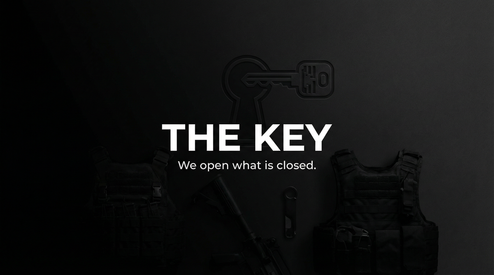

# THE KEY  
## Capabilities Overview — Product & Services Specification

**Classification:** Client-facing. Capabilities statement.  
**Provider:** OPEN WINDOW — Physical Entry & Access Engineering  
**Last Updated:** Current

---

> *Locks. Alarms. Access control. We open. You enter. No trace of how. We open what is closed.*
>
> ***We open what is closed.***

---

### Executive Summary

The Key is our flagship offering: physical access to secured spaces. Locks. Alarms. Access control. We open. You enter. No trace of how. **We open what is closed.**

**We do not ask why. We deliver access.**

---

## I. CORE DEFINITIONS

### Primary Definition
**The Key** is a physical entry system that gains access to secured spaces—overcoming locks, alarms, and access control—without leaving trace of method or presence.

### One-Sentence Definition
**The Key is a multi-tier entry system comprising single (one location), key (multi-point), and window (extended access) modes—operating toward undetectable physical access.**

**What we offer: the full stack. What you get: you enter.**

---

## II-A. PRICING

| Tier | Scope | Price (USD) |
|------|-------|-------------|
| **SINGLE** | One location. One entry. | $50,000 – $150,000 |
| **KEY** | Multi-point. Ongoing access. | $200,000 – $500,000 |
| **WINDOW** | Extended. Full access. | $750,000 – $2,000,000 |

---

## III–VIII. ARCHITECTURE | CAPABILITIES | MODES | PROFILES | DELIVERABLES | BOUNDARIES

**Capabilities:** Lock bypass; Alarm neutralization; Access control; Entry/egress. **Profiles:** Litigation; Corporate; Physical acquisition; Reconnaissance. **Boundaries:** Physical constraints apply. No guarantee when systems are upgraded. All actions per client authorization.

---

## IX. ENGAGEMENT

**We assume nothing. We deliver access.** Payment in advance. Target feasibility evaluated at intake.

---

> *We open what is closed.*
>
> **Inquire: See [05_INQUIRY_PROTOCOL](./05_INQUIRY_PROTOCOL.md). Discretion assured. Payment in advance.**
