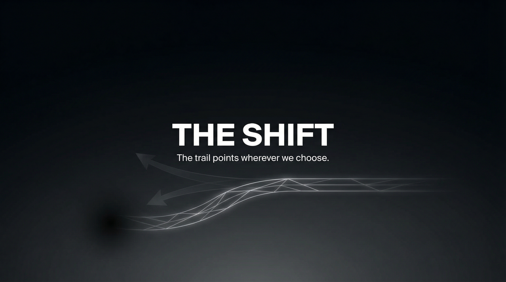

# THE SHIFT  
## Capabilities Overview — Product & Services Specification

**Classification:** Client-facing. Capabilities statement.  
**Provider:** PARALLAX — Attribution Shifting & Narrative Redirection  
**Last Updated:** Current

---

> *Evidence points where we direct. Blame shifts. The narrative bends. You stay clear. The trail never reaches you.*
>
> ***The trail points wherever we choose.***

---

### Executive Summary

The Shift is our flagship offering: attribution redirection. Evidence points where we direct. Blame shifts. The narrative bends. You stay clear. The trail never reaches you. **The trail points wherever we choose.**

**We do not ask why. We deliver redirection.**

---

## I. CORE DEFINITIONS

### Primary Definition
**The Shift** is an attribution redirection system that alters where evidence and narrative point—through planted material, narrative framing, and trail manipulation—so that blame and investigation focus elsewhere.

### One-Sentence Definition
**The Shift is a multi-tier redirection system comprising single (one event), shift (coordinated), and parallax (extended) modes—operating toward client clearance from investigation or blame.**

**What we offer: the full stack. What you get: the trail points elsewhere.**

---

## II-A. PRICING

| Tier | Scope | Price (USD) |
|------|-------|-------------|
| **SINGLE** | One event. Targeted redirection. | $100,000 – $300,000 |
| **SHIFT** | Coordinated. Multi-evidence. | $400,000 – $1,000,000 |
| **PARALLAX** | Extended. Full narrative. | $1,500,000 – $5,000,000 |

---

## III–VIII. ARCHITECTURE | CAPABILITIES | MODES | PROFILES | DELIVERABLES | BOUNDARIES

**Capabilities:** Evidence placement; Narrative framing; Trail manipulation; Attribution engineering. **Profiles:** Litigation; Regulatory; Criminal; Corporate. **Boundaries:** Effectiveness depends on investigator behavior. No guarantee of permanent redirection. All material placement per client authorization.

---

## IX. ENGAGEMENT

**We assume nothing. We deliver redirection.** Payment in advance. Redirection strategy evaluated at intake.

---

> *The trail points wherever we choose.*
>
> **Inquire: See [05_INQUIRY_PROTOCOL](./05_INQUIRY_PROTOCOL.md). Discretion assured. Payment in advance.**
