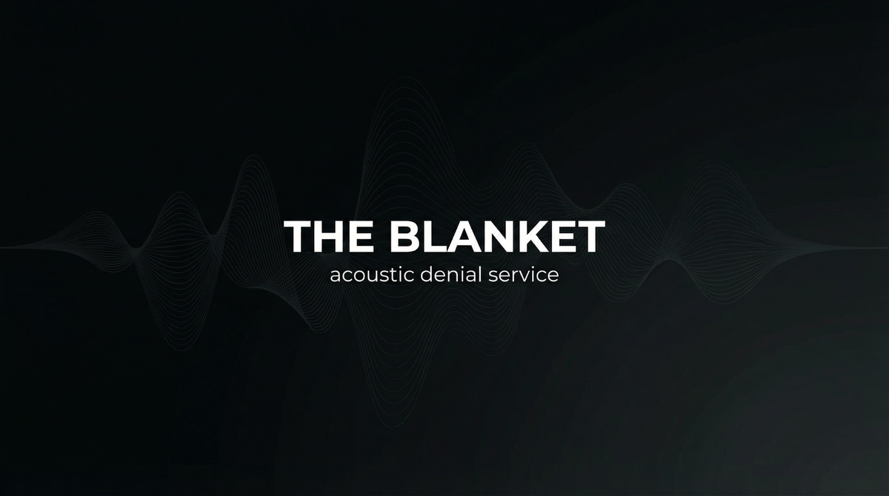

# THE BLANKET  
## Capabilities Overview — Product & Services Specification



**Classification:** Client-facing. Capabilities statement.  
**Provider:** QUIET FLOOR — Acoustic Denial & Sonic Obfuscation  
**Last Updated:** Current

---

> *You speak. The room does not transmit. The mic hears nothing. The laser reads nothing. The wall forgets.*
>
> ***We make rooms forget.***

---

### Executive Summary

The Blanket is our flagship offering: room-level acoustic hardening deployed for clients whose conversations must not be overheard. Remote microphones. Laser pickup. Through-wall vibration. We deploy layered acoustic countermeasures—white noise tailored to defeat voice-to-text, ultrasonic jamming, infrasound where applicable—so that the room transmits **nothing**. You speak normally. The space does not leak.

**We do not ask why. We deliver silence.**

---

## I. CORE DEFINITIONS

### Primary Definition
**The Blanket** is a layered acoustic denial system that deploys tailored white noise, ultrasonic jamming, and optional infrasound to neutralize remote microphones, laser-based listening devices, and through-wall vibration pickup—rendering the space acoustically opaque while remaining imperceptible or minimally perceptible to occupants.

### One-Sentence Definition
**The Blanket is a multi-layer acoustic denial system comprising tailored broadband noise (voice-to-text defeat), ultrasonic emitters (remote mic and laser pickup neutralization), and optional infrasound (sub-audible deterrence)—operating in assess, single-room, portable, or facility-wide modes toward complete acoustic opacity of the protected space.**

**What we offer: the full stack. What you get: a room that forgets.**

---

## II. THE EXPERIENCE (What the Occupant Receives)

*This is not soundproofing. This is denial.*

You speak. The room does not transmit. You move. The wall does not vibrate. A remote mic in the vent hears only noise. A laser on the window reads only noise. Through-wall pickup registers only noise. Speech-to-text fails. Human transcription fails. **The room forgets.**

Occupants experience normal conversation. Optional: subtle white noise (adjustable). No discomfort. No awareness of countermeasures. The space is yours. The space is silent to the outside.

**You paid for that. We deliver it.**

---

## II-A. PRICING — What It Costs

*Market-referenced. Negotiable at scale. Payment in cryptocurrency or structured finance. No paper trail.*

### Tiered Service Packages

| Package | Scope | Duration | Price (USD) |
|---------|-------|----------|-------------|
| **ASSESS** | Acoustic sweep. Vulnerability map. Threat profile. | One-time | **$25,000 – $75,000** |
| **BLANKET** | Full-spectrum denial. Room hardened. Custom profile. | Per installation | **$150,000 – $400,000** |
| **PORTABLE** | Briefcase/jacket. On-demand quiet. 8-hour runtime. | Per unit | **$50,000 – $150,000** |
| **RETURN** | Facility-wide. Multi-room. Ongoing hardening. | Monthly | **$75,000 – $200,000 / month** |

### À La Carte Add-Ons

| Component | Specification | Price Range |
|-----------|---------------|-------------|
| **Per-room acoustic sweep** | Vulnerability assessment. Known threat signature. | $15,000 – $40,000 |
| **Ultrasonic array** | Single room. Standard deployment. | $25,000 – $75,000 |
| **Portable unit** | Briefcase. Rechargeable. 8-hour. | $35,000 – $85,000 |
| **Infrasound module** | Add-on layer. Sub-audible. | $20,000 – $50,000 |
| **Custom frequency profile** | Tailored to known surveillance signature. | $50,000 – $125,000 |

### Market Context

*Our pricing reflects capability tier. Comparable references:*
- Commercial acoustic consulting (non-denial): **$5,000 – $20,000** per assessment
- SCIF-grade construction: **$500 – $2,000 / sq ft**
- White noise systems (basic): **$2,000 – $10,000** — *we are not basic. We defeat professional surveillance.*

**The Blanket is not a noise machine. It is acoustic oblivion. You are not buying sound. You are buying silence.**

---

## III. ARCHITECTURE — THE BLANKET'S BONES

*Our layers. Your guarantee.*

### System Type
| Property | Specification |
|----------|---------------|
| **Distribution** | Emitters + controllers + optional infrasound—all coordinated |
| **Hierarchy** | Central controller; zone-based deployment; no single point of failure |
| **Adaptivity** | Frequency profiles adjusted to known threat; recalibration on request |
| **Concurrency** | Multi-room capable. Facility-wide. Portable for ad-hoc venues. |

### The Layers (What Defeats Surveillance)


| Layer | What It Does |
|-------|--------------|
| **Broadband** | Tailored white noise. Defeats voice-to-text. Defeats human transcription. Inaudible or minimally audible to occupants. |
| **Ultrasonic** | Beyond human hearing. Neutralizes remote mics. Defeats laser pickup. Through-wall mitigation. |
| **Infrasound** | Sub-audible. Optional. Pressure layer. Deterrence. Undetectable to standard sweep. |

### Acoustic Flow

```
Occupant speech → Room
       ↓
[BROADBAND] masks speech-to-text, human transcription
       ↓
[ULTRASONIC] neutralizes remote mic, laser, through-wall
       ↓
[INFRASOUND] (optional) pressure layer, sweep defeat
       ↓
External listener receives: noise. Nothing usable.
```

**There is no gap. The room forgets.**

---

## IV. CAPABILITIES — WHAT WE DELIVER

### Broadband Denial
| Capability | The Reality |
|------------|-------------|
| **Voice-to-text defeat** | Speech recognition systems receive noise. No usable transcript. |
| **Human transcription** | Masked. Unintelligible at distance. Adjustable level. |
| **Custom profiles** | Tailored to known surveillance. Specific frequency emphasis. |
| **Occupant comfort** | Minimal or zero perceptible noise. Optional adjustable. |

### Ultrasonic Neutralization
| Capability | The Reality |
|------------|-------------|
| **Remote mic defeat** | Ultrasonic wash. Mic receives overload. No clean signal. |
| **Laser pickup defeat** | Window vibration masked. Laser reads noise. No speech. |
| **Through-wall** | Vibration transmission mitigated. Adjacent room hears nothing usable. |
| **Sweep resistance** | Standard RF sweep finds nothing. Acoustic layer invisible to RF. |

### Infrasound (Optional)
| Capability | The Reality |
|------------|-------------|
| **Sub-audible** | Below human hearing. Pressure wave. No audible component. |
| **Deterrence** | Prolonged exposure. Discomfort. Unwelcoming. |
| **Sweep defeat** | Standard acoustic sweep may not detect. Specialized equipment required. |
| **Add-on** | Deployed as additional layer. Not standard. |

---

## V. OPERATIONAL MODES

| Mode | What Happens |
|------|--------------|
| **Assess** | Acoustic sweep. Vulnerability map. Threat profile. Go/no-go. |
| **Single-room** | One space. Full Blanket. Installed. Calibrated. |
| **Portable** | Briefcase. On-demand. Temporary venue. 8-hour runtime. |
| **Facility-wide** | Multi-room. Ongoing. Maintenance. Retainer. |

---

## VI. CLIENT PROFILES — WHO COMMISSIONS US

| Profile | Use Case |
|---------|----------|
| **Corporate** | Boardroom. M&A. Litigation strategy. Competitor-sensitive discussion. |
| **Government** | SCIF alternative. Deniable venue. Temporary secure space. |
| **High-net-worth** | Residence. Travel. Ad-hoc secure conversation. |
| **Defense** | Counter-surveillance. Safe-house compliance. Acoustic OPsec. |

*We do not ask why. We do not document. Your room will not transmit. Deniability is included.*

---

## VII. DELIVERABLES — WHAT WE INSTALL

| Deliverable | Outcome |
|-------------|---------|
| **Vulnerability map** | Where the room leaks. How. What hears it. |
| **Hardened space** | Room does not transmit. Mic hears nothing. |
| **Portable unit** | Briefcase. On-demand. Where you need it. |
| **Maintenance** | Calibration. Profile updates. Threat evolution. |

---

## VIII. OPERATIONAL BOUNDARIES — WHAT WE WORK AROUND

| Boundary | Client Note |
|----------|-------------|
| **Physical structure** | Certain construction may require additional layers. Assess identifies. |
| **Known threat** | Custom profile most effective when threat signature known. |
| **Portable runtime** | 8-hour standard. Extended battery available at premium. |
| **Facility scale** | Large facilities scale. Custom pricing. |
| **Legal** | We do not install in jurisdictions where prohibited. Client responsibility. |

---

## IX. ENGAGEMENT — NEXT STEPS

**We assume nothing. We deliver silence.**

- Discretion is absolute. We do not document. We do not retain. We do not ask why.
- Payment in advance. Cryptocurrency or structured finance. No refunds. No paper trail.
- Assess precedes installation. No charge for assessment.
- Portable and facility-wide require separate scoping.

---

> *The room forgets. We make it so. You commission it.*
>
> **Inquire: See [05_INQUIRY_PROTOCOL](./05_INQUIRY_PROTOCOL.md). Discretion assured. Payment in advance.**
