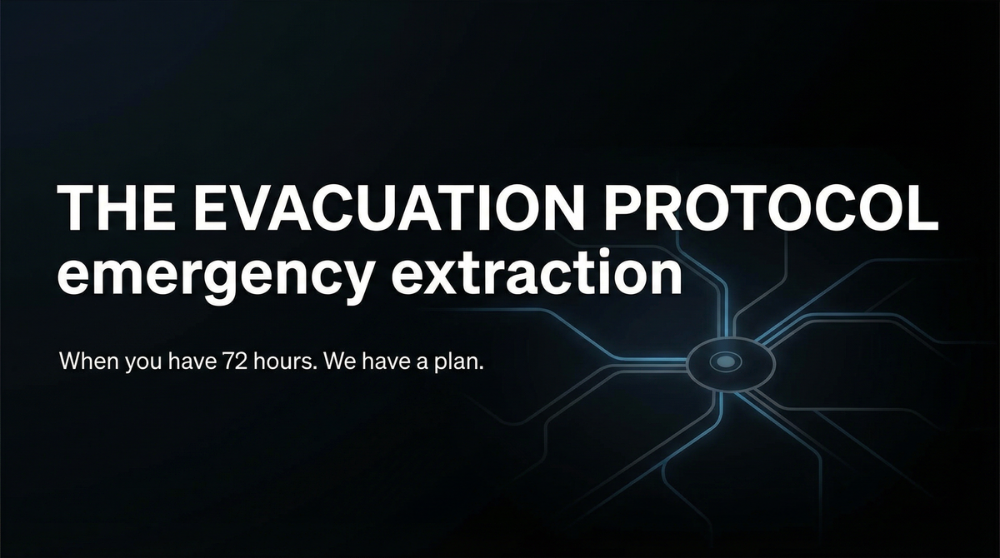

# THE EVACUATION PROTOCOL  
## Capabilities Overview — Product & Services Specification

**Classification:** Client-facing. Capabilities statement.  
**Provider:** RED ACT — Emergency Extraction & Crisis Response  
**Last Updated:** Current

---

> *You call. We move. You arrive. No trace of how. Transport. Handoffs. Identity sanitization. Safe haven. 72 hours.*
>
> ***When you have 72 hours. We have a plan.***

---

### Executive Summary

The Evacuation Protocol is our flagship offering: 72-hour global extraction with safe-haven routing and identity sanitization. Transport. Handoffs. Destination support. Pre-positioned or on-demand. You call. We execute. **No trace of how.**

**We do not ask why. We deliver extraction.**

---

## I. CORE DEFINITIONS

### Primary Definition
**The Evacuation Protocol** is a coordinated emergency extraction system that moves principals from hostile environments to safe havens within 72 hours—providing transport, handoffs, identity sanitization, and destination support with no trace of the route or method.

### One-Sentence Definition
**The Evacuation Protocol is a multi-tier extraction system comprising standby retainer, single extraction, full protocol (identity + safe haven), and family extraction—operating in 72-hour execution toward the principal's safe arrival at designated haven.**

**What we offer: the full stack. What you get: you arrive.**

---

## II. THE EXPERIENCE | II-A. PRICING | III. ARCHITECTURE | IV. CAPABILITIES

| Tier | Price | Scope |
|------|-------|------|
| **STANDBY** | $150K–$350K/yr | One-call activation. Pre-positioned. |
| **EXTRACTION** | $250K–$750K | Single engagement. 72-hour execution. |
| **FULL PROTOCOL** | $500K–$1.5M | Extraction + identity + safe haven. |
| **FAMILY** | Custom | Multiple principals. Extended. |

**Capabilities:** Extraction; Identity sanitization; Safe haven; Logistics. **Operational boundaries:** Geopolitical constraints; No guarantee against interception.

---

## IX. ENGAGEMENT — NEXT STEPS

**We assume nothing. We deliver extraction.** Payment in advance. Standby enables one-call activation.

---

> *When you have 72 hours. We have a plan.*
>
> **Inquire: See [05_INQUIRY_PROTOCOL](./05_INQUIRY_PROTOCOL.md). Discretion assured. Payment in advance.**
