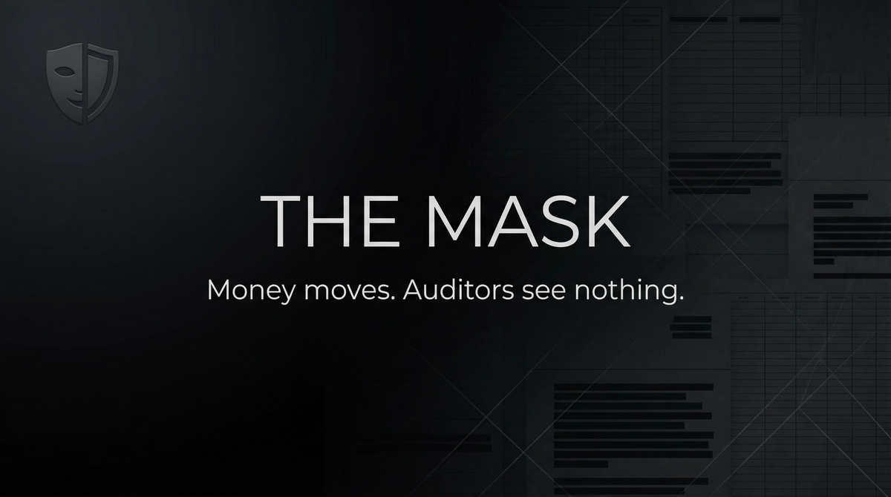

# THE MASK  
## Capabilities Overview — Product & Services Specification



**Classification:** Client-facing. Capabilities statement.  
**Provider:** SHADOW LEDGER — Financial Obfuscation & Trail Masking  
**Last Updated:** Current

---

> *Transactions occur. Money moves. Auditors see nothing. The ledger shows what we allow. Books balance. Books hide.*
>
> ***Money moves. Auditors see nothing.***

---

### Executive Summary

The Mask is our flagship offering: financial trail masking. Transactions occur. Money moves. Auditors see nothing. The ledger shows what we allow. Books balance. Books hide. **Money moves. Auditors see nothing.**

**We do not ask why. We deliver obfuscation.**

---

## I. CORE DEFINITIONS

### Primary Definition
**The Mask** is a financial obfuscation system that structures transactions, routes flows, and manages ledgers so that auditors, regulators, or investigators see a compliant, balanced picture—while actual movement remains masked.

### One-Sentence Definition
**The Mask is a multi-tier obfuscation system comprising single (one transaction/entity), mask (full structure), and shadow (extended) modes—operating toward auditor-invisible financial movement.**

**What we offer: the full stack. What you get: money moves. Auditors see nothing.**

---

## II. THE EXPERIENCE (What the Client Receives)

*Transactions occur. Money moves. Auditors see nothing.*

The ledger shows what we allow. Books balance. Books hide. Structure. Route. Mask. **Money moves. Auditors see nothing.**

**You paid for that. We deliver it.**

---

## II-A. PRICING — What It Costs

### Tiered Service Packages

| Package | Scope | Price (USD) |
|---------|-------|-------------|
| **SINGLE** | One transaction or entity. | $75,000 – $200,000 |
| **MASK** | Full structure. Multi-entity. | $300,000 – $750,000 |
| **SHADOW** | Extended. Multi-jurisdiction. | $1,000,000 – $3,000,000 |

### À La Carte Add-Ons

| Component | Specification | Price Range |
|-----------|---------------|-------------|
| **Transaction structuring** | Single. Entity. | $75,000 – $200,000 |
| **Flow routing** | Multi-entity. Cross-border. | $150,000 – $400,000 |
| **Ledger management** | Audit surface. Compliance. | $200,000 – $500,000 |

---

## III. ARCHITECTURE

### System Type
| Property | Specification |
|----------|---------------|
| **Distribution** | Transaction structuring; flow routing; ledger management; audit compliance surface |
| **Retention** | Structure documentation. No client identity. |
| **Forensic profile** | Legal compliance surface. Auditor-invisible movement. |

### Flow
```
Value to move → Single (one transaction/entity)
       ↓
Mask (full structure, multi-entity)
       ↓
Shadow (extended, multi-jurisdiction)
       ↓
Money moves. Auditors see nothing.
```

---

## IV. CAPABILITIES

### Transaction Structuring
| Capability | Specification |
|------------|---------------|
| **Entity design** | Shell. Trust. Structure. |
| **Flow design** | Route. Layering. Opaque. |

### Ledger Management
| Capability | Specification |
|------------|---------------|
| **Audit surface** | Compliant. Balanced. |
| **Books** | What we allow. What we hide. |

---

## V. OPERATIONAL MODES

| Mode | What Happens |
|------|--------------|
| **Single** | One transaction or entity. |
| **Mask** | Full structure. Multi-entity. |
| **Shadow** | Extended. Multi-jurisdiction. |

---

## VI. CLIENT PROFILES

| Profile | Use Case |
|---------|----------|
| **Litigation** | Asset protection. Judgment. |
| **Regulatory** | Compliance surface. Opaque. |
| **Corporate** | M&A. Divestiture. Restructure. |
| **Asset protection** | Wealth. Inheritance. |

---

## VII. DELIVERABLES

| Deliverable | Outcome |
|-------------|---------|
| **Structure** | Entity. Trust. Route. |
| **Ledger** | Compliant surface. Masked movement. |
| **Obfuscation** | Money moves. Auditors see nothing. |

---

## VIII. OPERATIONAL BOUNDARIES

| Boundary | Client Note |
|----------|-------------|
| **Jurisdiction** | Structure depends on forum. |
| **Forensic audit** | No guarantee against deep audit. |
| **Legal compliance** | All structures designed for compliance surface. |
| **Counsel** | Tax. Legal. Coordination required. |

---

## IX. ENGAGEMENT — NEXT STEPS

**We assume nothing. We deliver obfuscation.**

- Discretion absolute. We do not document. We do not retain.
- Payment in advance. Jurisdiction and structure feasibility evaluated at intake.
- No charge for assessment.

---

> *Money moves. Auditors see nothing.*
>
> **Inquire: See [05_INQUIRY_PROTOCOL](./05_INQUIRY_PROTOCOL.md). Discretion assured. Payment in advance.**
