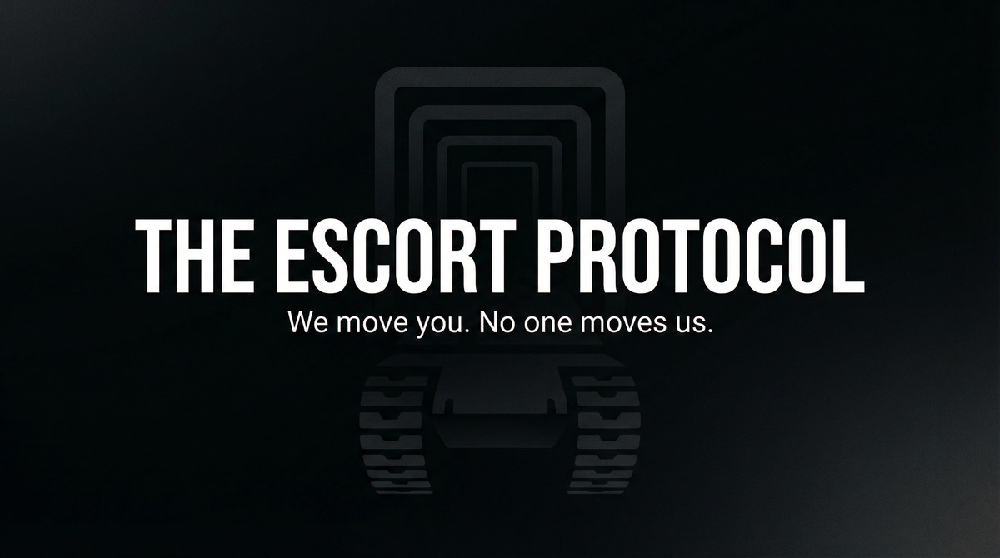

# THE ESCORT PROTOCOL  
## Capabilities Overview — Product & Services Specification

**Classification:** Client-facing. Capabilities statement.  
**Provider:** SILENT HAND — Physical Security & Escort Services  
**Last Updated:** Current

---

> *Armed escort. Route clearance. Handoffs. Safe haven. We move principals. We do not ask why. We deliver.*
>
> ***We move you. No one moves us.***

---

### Executive Summary

The Escort Protocol is our flagship offering: armed escort, extraction support, and safe-haven delivery. We move principals through hostile or uncertain environments. Routes are cleared. Handoffs are coordinated. **No one moves us.**

**We do not ask why. We deliver security.**

---

## I. CORE DEFINITIONS

### Primary Definition
**The Escort Protocol** is a coordinated physical security system that provides armed escort, route clearance, extraction support, and safe-haven delivery—moving principals from origin to destination with minimal exposure and maximum control.

### One-Sentence Definition
**The Escort Protocol is a multi-tier physical security system comprising escort, full-run (multi-leg), and full-protocol (extraction + identity) modes—operating toward the principal's safe delivery at designated destination.**

**What we offer: the full stack. What you get: you arrive.**

---

## II. THE EXPERIENCE (What the Client Receives)

*This is not bodyguard. This is escort.*

You move. We clear. Routes are secured. Handoffs occur. Extraction support available. Safe haven at destination. You are moved. No one moves us.

**You paid for that. We deliver it.**

---

## II-A. PRICING — What It Costs

| Package | Scope | Price (USD) |
|---------|-------|-------------|
| **ESCORT** | Single leg. Armed. Route clearance. | $50,000 – $150,000 |
| **FULL RUN** | Multi-leg. Extraction support. Safe haven. | $200,000 – $500,000 |
| **PROTOCOL** | Full protocol. Identity support. Extended. | $750,000 – $2,000,000 |

### À La Carte: Route planning $15K–$40K | Armed escort $25K–$75K/day | Safe-haven staging $50K–$150K

---

## III. ARCHITECTURE — Route clearance, Handoffs, Escort coordination

## IV. CAPABILITIES — Armed escort, Route clearance, Extraction support, Safe haven

## V. OPERATIONAL MODES — Escort, Full Run, Protocol

## VI. CLIENT PROFILES — Extraction, Witness, Defection, Corporate

## VII. DELIVERABLES — Safe transit, Safe haven, Coordination

## VIII. OPERATIONAL BOUNDARIES — Jurisdiction, Force limits, Client compliance

## IX. ENGAGEMENT — NEXT STEPS

**We assume nothing. We deliver.** Payment in advance. Assessment precedes engagement.

---

> *We move you. No one moves us.*
>
> **Inquire: See [05_INQUIRY_PROTOCOL](./05_INQUIRY_PROTOCOL.md). Discretion assured. Payment in advance.**
